МІНІСТЕРСТВО ОСВІТИ І НАУКИ УКРАЇНИ

НАЦІОНАЛЬНИЙ ТЕХНІЧНИЙ УНІВЕРСИТЕТ УКРАЇНИ
«КИЇВСЬКИЙ ПОЛІТЕХНІЧНИЙ ІНСТИТУТ ІМЕНІ ІГОРЯ СІКОРСЬКОГО»

# БІЗНЕС-АНАЛІЗ В ІТ

### Лабораторний практикум

Рекомендовано Методичною радою КПІ ім. Ігоря Сікорського
як навчальний посібник для здобувачів ступеня магістра
за освітньою програмою «Інженерія програмного забезпечення інформаційних систем»
спеціальності F2 «Інженерія програмного забезпечення»

Автор: Д.А. Гобов

Електронне мережеве навчальне видання

Київ
КПІ ім. Ігоря Сікорського
2025

---

УДК 004.4(075.8)

Автори:  *Гобов Денис Андрійович*, канд. техн. наук

Рецензент  *Жданова О. Г.*, канд. техн. наук, доц.

Відповідальний
редактор  *Олійник Ю. О.,* канд. техн. наук

*Гриф надано Методичною радою КПІ ім. Ігоря Сікорського*
*(протокол № 3 від 12.12.2025 р.)*
*за поданням вченої ради Факультету інформатики та обчислювальної техніки*
*(протокол № 3 від 27.10.2025 р.)*

**Бізнес-аналіз в IT** [Електронний ресурс] : лаб. практикум: навч. посіб. для здобувачів ступеня магістра за освіт. програмою «Інженерія програмного забезпечення інформаційних систем» спец. F2 «Інженерія програмного забезпечення» / КПІ ім. Ігоря Сікорського; автор: Д.А. Гобов. – Електрон. текст. дані (1 файл). – Київ : КПІ ім. Ігоря Сікорського, 2025. – 103 с.

Навчальний посібник охоплює теоретичний матеріал та практичні завдання, які необхідні для виконання лабораторних робіт з дисципліни «Бізнес-аналіз в IT» для студентів, які навчаються за спеціальністю F2 «Інженерія програмного забезпечення». Навчальний посібник може бути корисним студентам відповідних спеціальностей при вивченні дисциплін, пов'язаних із бізнес-аналізом та інженерією програмного забезпечення, моделюванням процесів і архітектури в проєктах з розробки програмного забезпечення, а також при виконанні магістерських атестаційних робіт, курсових проєктів, в яких використовується нотації моделювання BPMN, UML та відповідні техніки документування вимог.

УДК 004.4(075.8)

Реєстр. № НП 25/26-086. Обсяг 4,0 авт. арк.

Національний технічний університет України
«Київський політехнічний інститут імені Ігоря Сікорського»
проспект Берестейський, 37, м. Київ, 03056
https://kpi.ua
Свідоцтво про внесення до Державного реєстру видавців, виготовлювачів
і розповсюджувачів видавничої продукції ДК № 5354 від 25.05.2017 р.

© Д. А. Гобов, 2025
© КПІ ім. Ігоря Сікорського, 2025

## ЗМІСТ

1 ЗАГАЛЬНІ ПОЛОЖЕННЯ ..... 4

2 ЗАГАЛЬНІ МЕТОДИЧНІ ВКАЗІВКИ ..... 6

ЛАБОРАТОРНА РОБОТА №1 АНАЛІЗ ЗАЦІКАВЛЕНИХ ОСІБ: МАТРИЦЯ ЗАЦІКАВЛЕНИХ ОСІБ ..... 9

ЛАБОРАТОРНА РОБОТА №2 АНАЛІЗ ЗАЦІКАВЛЕНИХ ОСІБ: RACI МАТРИЦЯ ..... 20

ЛАБОРАТОРНА РОБОТА №3 КАНВА БІЗНЕС-МОДЕЛІ ..... 27

ЛАБОРАТОРНА РОБОТА №4 АНАЛІЗ ЗОВНІШНІХ ТА ВНУТРІШНІХ ФАКТОРІВ (SWOT АНАЛІЗ) ..... 45

ЛАБОРАТОРНА РОБОТА №5 РЕЄСТР РИЗИКІВ ..... 51

ЛАБОРАТОРНА РОБОТА №6 СЦЕНАРІЇ АТРИБУТІВ ЯКОСТІ ..... 59

ЛАБОРАТОРНА РОБОТА №7 МОДЕЛЮВАННЯ БІЗНЕС-ПРОЦЕСІВ В НОТАЦІЇ BPMN 2.0 ..... 66

ЛАБОРАТОРНА РОБОТА №8 РОЗРОБКА ФУНКЦІОНАЛЬНИХ ВИМОГ В ФОРМАТІ ВАРІАНТІВ ВИКОРИСТАННЯ ТА ІСТОРІЙ КОРИСТУВАЧА ..... 87

СПИСОК ЛІТЕРАТУРИ ..... 100

ДОДАТОК 1 ТИТУЛЬНИЙ АРКУШ ЗВІТУ ..... 103

## 1 ЗАГАЛЬНІ ПОЛОЖЕННЯ

Дисципліна «Бізнес-аналіз в IT» вивчається на етапі підготовки фахівців освітньо-кваліфікаційного рівня «магістр» та має на меті забезпечити:

– набуття ключових фахових компетенцій, теоретичних знань і практичних навичок виконання бізнес-аналітичних задач та використання технік бізнес-аналізу в проєктах з розробки програмного забезпечення;
– ознайомлення з практичними рекомендаціями, накопиченими в галузі інженерії вимог та бізнес-аналізу;
– вивчення кращих практик по моделюванню статичних та поведінкових аспектів предметної галузі та програмного забезпечення;
– вивчення широко розповсюджених технік для документування бізнес вимог, вимог зацікавлених сторін, функціональних та нефункціональних вимог до програмного забезпечення;
– вивчення підходів до керування інформацією бізнес-аналізу та змінами в IT проєктах.

Завдання вивчення дисципліни обумовлене вимогами підготовки магістрів відповідно до кваліфікаційної характеристики зі спеціальності F2 «Інженерія програмного забезпечення».

По закінченню вивчення дисципліни студент набуває такі навички та вміння:

– володіння основною термінологією бізнес-аналізу та інженерії вимог, вміння пояснити ключові поняття та елементи моделі BACCM (Business Analysis Core Concept Model);
– розуміння переліку та змісту задач з бізнес-аналізу;
– вміння виконувати задачі з планування та моніторингу бізнес-аналітичних робіт, збору вимог до IT-рішень, аналізу та моделювання вимог;
– здатність виконувати передпроєктний стратегічний аналіз з побудовою бізнес-моделі для програмних продуктів;
– вміння керувати вимогами з урахуванням обраного життєвого циклу програмного забезпечення;
– вміння документувати вимоги різних видів, в тому числі із застосуванням варіантів використання, історій користувача, сценаріїв атрибутів якості, критеріїв приймання в формі Геркіна;
– вміння моделювати бізнес-процеси з використанням нотації BPMN.

## 2 ЗАГАЛЬНІ МЕТОДИЧНІ ВКАЗІВКИ

Посібник призначений для виконання лабораторних робіт з дисципліни "Бізнес-аналіз в IT". Для кожної з лабораторних робіт викладений систематизований теоретичний матеріал, наведені приклади використання відповідної техніки бізнес-аналізу, варіанти завдань, контрольні питання та рекомендована література. В процесі виконання лабораторних робіт студенти вивчають дві формальні нотації моделювання – BPMN (англ. Business Process Model and Notation, модель та нотація бізнес-процесів) та UML (англ. Unified Modeling Language – уніфікована мова моделювання), а також ряд технік бізнес-аналізу з Настанови до зводу знань з бізнес-аналізу (англ. A Guide to the Business Analysis Body of Knowledge, абревіатура BABOK).

BPMN є стандартом для моделювання бізнес-процесів, який містить графічну нотацію для визначення бізнес-процесу у вигляді "Діаграми бізнес-процесу" (англ. Business Process Diagram, BPD), метамодель та формат обміну. Така діаграма бізнес-процесу ґрунтується на представленні бізнес-процесу у вигляді блок-схеми, що семантично схожа на діаграму діяльності. BPMN був розроблений, щоб забезпечити стандартну нотацію, зрозумілу всім зацікавленим сторонам, включаючи бізнес-аналітиків, розробників, фахівців з якості та представників бізнесу [1]. Таким чином, BPMN можна використовувати для підтримки загальної бажаної мети всіх зацікавлених сторін у проєкті, використовуючи спільну мову для опису процесів, допомагаючи уникнути комунікаційних прогалин, які можуть виникнути між розробкою та впровадженням бізнес-процесу. Нотація BPMN підтримується багатьма програмними засобами, такими як Camunda, Bizagi, Signavio, які дозволяють не лише створювати діаграми, але й виконувати процеси, перевіряти коректність моделей і забезпечувати інтеграцію до інформаційних систем підприємств. Наразі йде робота над інтеграцією штучного інтелекту для автоматизації створення діаграм в нотації BPMN. Стандарт активно використовується при побудові процесно-орієнтованих систем у державному та приватному секторах економіки. Актуальна версія стандарту – 2.0.2, що була прийнята у січні 2014 року.

UML – це уніфікована мова візуального моделювання, створена в парадигмі об'єктно-орієнтованого програмування й призначена для визначення стандартного способу візуалізації дизайну систем [2]. UML включає в себе три класи діаграм: структурні, поведінки та взаємодії. UML є мовою широкого профілю, це відкритий стандарт, що використовує графічні позначення для створення абстрактної моделі системи, званої UML-моделлю. Використання UML забезпечує наявність єдиного бачення між командами бізнес-аналітиків, архітекторів, розробників і фахівців з тестування, сприяє створенню спільного розуміння структури системи та підвищенню якості програмного забезпечення. Актуальна версія стандарту 2.5.1 була затверджена у грудні 2017 року.

BABOK – це настанова до зводу знань, розроблений Міжнародним Інститутом бізнес-аналізу (англ. – International Institute of Business Analysis™, абревіатура IIBA). Включає в себе універсальний перелік задач бізнес-аналізу, що об'єднані в шість галузей знань, п'ятдесят технік бізнес-аналізу, що використовуються для виконання задач, базові компетенції бізнес-аналітика та перспективи, щодо проведення бізнес-аналізу в різних контекстах, в тому числі перспектива інформаційних технологій, перспектива Agile та перспектива бізнес-аналітики (Business Intelligence) [3]. Актуальна версія настанови до зводу знань 3.0, що була опублікована в 2015р.

Перед початком виконання лабораторних робіт студентам слід ознайомитися з відповідним теоретичним матеріалом. Після цього кожен студент отримує завдання до виконання. Лабораторні роботи слід виконувати послідовно, оскільки аспекти контексту та характеристики системи, що розглядається подаються в завданнях в логічній послідовності.

Загальні рекомендації до виконання завдань лабораторних робіт:

– кожен звіт щодо виконання завдання лабораторної роботи виконується та оформлюється у вигляді окремого документа з назвою ПрізвищеІніціали_ГрупаАА_ЛРВ_ВаріантСС, де АА – номер групи, В – номер лабораторної роботи, СС – номер варіанту;
– кожен звіт починається з титульного аркушу, на якому вказують тему завдання, номер варіанту, прізвище та ініціали виконавця (приклад у Додатку 1);
– звіт має містити опис варіанту завдання;
– діаграми, моделі та інший графічний матеріал лабораторних робіт виконується за допомогою спеціалізованого програмного забезпечення (Microsoft Visio, Bizagi Process Modeler) або вебзастосунків побудови діаграм і схем (Miro, Lucidchart, Diagrams.net).

## ЛАБОРАТОРНА РОБОТА №1
### АНАЛІЗ ЗАЦІКАВЛЕНИХ ОСІБ: МАТРИЦЯ ЗАЦІКАВЛЕНИХ ОСІБ

**Мета роботи** – отримати навички проведення аналізу зацікавлених сторін проєкту з використанням техніки «Матриця зацікавлених осіб (Stakeholder map)»

### Короткі теоретичні відомості

Бізнес-аналіз – це практика, яка уможливлює зміну в контексті підприємства, шляхом визначення потреб та рекомендації рішень, які забезпечують цінність для зацікавлених сторін [3]. Зацікавлена сторона – це група осіб або особа, що мають відношення до певної зміни, потреби чи рішення, що створюється в рамках проєкту або групи проєктів. Кожна задача бізнес-аналізу передбачає участь певних зацікавлених сторін безпосередньо у її виконанні та зацікавлених сторін, яких це завдання, торкнеться. Отже з будь-якою зацікавленою стороною бізнес-аналітик, ймовірно, буде взаємодіяти прямо чи опосередковано. Будь-яка зацікавлена сторона може бути джерелом вимог, припущень чи обмежень.

Зацікавлені можуть бути розбиті на наступні класи:

– споживач – використовує або може використовувати продукти чи послуги, вироблені підприємством, що є об'єктом змін/впровадження програмного продукту, і може мати договірні або моральні права, яких підприємство має дотримуватися;
– спонсор – відповідає за ініціацію дій з визначення бізнес-потреби та розробки рішення, яке задовільнить цю потребу, надає дозвіл на виконання робіт і контролює бюджет і обсяг ініціативи;
– експерт з предметної галузі – володіє конкретною експертизою в темі, що має відношення до бізнес-потреби чи рішення;
– профільний експерт із впровадження – має спеціалізовані знання щодо впровадження одного або кількох компонентів рішення (наприклад, розробник програмного забезпечення, адміністратор баз даних, архітектор, дизайнер, фахівець з провадження змін тощо);
– керівник проєкту – відповідає за управління роботою, необхідною для надання рішення, що відповідає бізнес-потребам, і для забезпечення досягнення цілей проєкту, балансуючи обмеженнями проєкту, включно з обсягом, бюджетом, графіком, ресурсами, якістю та ризиками;
– фахівець з тестування (фахівець з контролю якості) – особа, відповідальна за визначення, як верифікувати, що рішення відповідає вимогам, визначених бізнес-аналітиком, та проведення процесу верифікації;
– кінцевий користувач – людина, яка буде напряму взаємодіяти із рішенням (IT системою);
– служба операційної підтримка та супроводження – відповідає за щоденне управління та підтримку системи чи продукту;
– постачальник – зацікавлена сторона поза межами даної організації або підрозділу, яка постачає послуги чи продукти для організації та може мати договірні або моральні права і зобов'язання, які необхідно враховувати;
– регулятор – зацікавлена сторона поза межами організації, що відповідає за визначення та виконання стандартів.

Враховуючи наведену класифікацію зацікавлені сторони можуть бути згруповані в наступні групи, враховуючи сучасні практики замовної розробки:

– Проєктна команда: керівник проєкту, профільний експерт із впровадження, фахівець з тестування;
– Представники бізнесу (підприємства): спонсор, кінцевий користувач, операційна підтримка, експерт з предметної галузі;
– Зовнішні зацікавлені сторони: споживач, постачальник, регулятор.

Початковий аналіз зацікавлених сторін проводиться в рамках планування залучення зацікавлених сторін до бізнес-аналітичних задач. Розуміння того, хто є зацікавленими сторонами, як запропоновані зміни вплинуть на них і який вплив вони можуть мати на зміни, є критично важливим для розуміння того, які потреби та очікування має задовольнити рішення. Планування залучення зацікавлених сторін описує визначення того, які зацікавлені сторони мають відношення до впровадження зміни, яка їхня роль у запланованих змінах в частині бізнес-процесів, організаційній структурі та програмного забезпечення, які основні характеристики мають бути виявлені, проаналізовані й задокументовані для подальшого планування взаємодії, яка інформація потрібна фахівцям з бізнес-аналізу від них, яка інформація потрібна їм від фахівців з бізнес-аналізу, а також найкращий спосіб співпраці з ними, беручи до уваги їхні потреби в комунікації, сферу відповідальності та наявні ресурси.

Бізнес-аналітики використовуються різноманітні техніки для виявлення зацікавлених сторін [4]. До найбільш популярних відносяться мозковий штурм, інтерв'ю та аналіз документів (опис організаційної структури компанії, опис бізнес-процесів, посадові інструкції та положення). Також може використовуватись метод «снігової кулі» (snowball sampling) – розширення переліку зацікавлених сторін шляхом опитування вже виявлених. Головна мета при використанні цих технік - отримати якомога повніший список зацікавлених сторін, оскільки він має ключове значення як для аналізу їх діяльності, так і для планування подальших бізнес-аналітичних робіт (виявлення, верифікація, валідація вимог тощо).

Список зацікавлених сторін може бути досить довгим. У ході проведення аналізу бізнес-аналітик здійснює категоризацію та структурує список. Важливо мати вичерпний список, щоб переконатися в тому, що не втрачають жодних важливих зацікавлених сторін або груп зацікавлених сторін і, відповідно, не виникає ризик пізніше упустити вимоги. Список зацікавлених осіб може містити наступну інформацію:

– ПІБ;
– посада;
– організація;
– назва підрозділу;
– контактні дані: телефон, e-mail, месенджери;
– часовий пояс (для міжнародних проєктів);
– мова спілкування (для міжнародних проєктів);
– бажаний формат комунікації;
– рівень впливу на проєкт;
– рівень впливу проєкту на зацікавлену сторону;
– рівень зацікавленості в проєкті;
– ключові очікування.

Карти зацікавлених сторін – це діаграми, що показують зв'язки зацікавлених сторін із рішенням та між собою. Найпоширенішою з них є матриця зацікавлених сторін, яка співвідносить рівень впливу з рівнем зацікавленості зацікавленої сторони [5]. Бізнес-аналітик зазвичай розпочинає аналіз зацікавлених сторін розглядаючи запропоновані границі рішення, а потім аналізуючи, яких груп торкнуться зміни. Для цього бізнес-аналітик може створити матрицю зацікавлених сторін з метою визначення всіх зацікавлених сторін та їх ролей щодо розробки вимог. У ході проєкту позиції зацікавлених сторін у матриці можуть змінюватися внаслідок організаційних змін, бізнес-контексту чи границь рішення. Зважаючи на ці можливі зміни, аналіз зацікавлених сторін виконується ітеративно та часто переглядається бізнес-аналітиком.

Матриця зацікавлених сторін передбачає графічне розбиття зацікавлених сторін на 4 групи відповідно до їх рівня впливу на проєкт та вплив проєкту на них:

– високий вплив зацікавленої сторони/великий вплив на зацікавлену сторону:

  a) ця група зацікавлених сторін містить ключових учасників проєкту;
  b) бізнес-аналітик повинен зосередити свої зусилля та регулярно залучати цю групу;
  c) до цієї групи належить спонсор, власник продукту, менеджер продукту, ключові представники великих груп кінцевих користувачів та/або споживачів тощо.

– високий вплив зацікавленої сторони/низький вплив на зацікавлену сторону:

  a) ця група містить зацікавлені сторони, чиї потреби мають бути задоволені;
  b) бізнес-аналітик повинен залучати їх і консультуватися з ними, а також намагатися залучити їх і підвищити рівень їх інтересу до змін;
  c) до цієї групи належить регулятор, постачальники-монополісти, керівники суміжних департаментів та відділів.

– Низький вплив зацікавленої сторони /великий вплив на зацікавлену сторону:

  a) Ця група містить прихильників та потенційних послів доброї волі для змін;
  b) бізнес-аналітик повинен залучити цю групу до їхнього внеску та проявити інтерес до їхніх потреб;
  c) до цієї групи належать кінцеві користувачі та споживачі.

– Низький вплив зацікавленої сторони /малий вплив на зацікавлену сторону:

  a) ця група містить тих, хто поки не залучений або слабко залучений в проєкт і може бути проінформований за допомогою загальних комунікацій;
  b) розширення границь рішення, зміна організаційної структури або нормативно-правової бази та інші зміни в контексті проєкту можуть перемістити їх у квадрант «низькій вплив зацікавленої особи/великий вплив на зацікавлену особу» або «високий вплив зацікавленої особи/низький вплив на зацікавлену особу»;
  c) до цієї групи відносяться ті зацікавлені сторони, яку потенційно можуть бути залучені до бізнес-аналітичних задач по ходу росту та розвитку проєкту.

Форма матриці зацікавлених сторін наведений нижче (рис. 1.1).

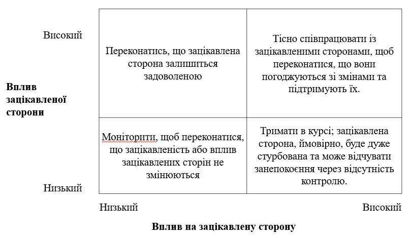

*Рисунок 1.1 – Форма матриці зацікавлених сторін.*

Приклад заповненої матриці зацікавлених сторін для проєкту «Єдиний державний демографічний реєстр» наведено на рис. 1.2. При формуванні даного прикладу основна увага була приділена зовнішнім відносно команди зацікавленим сторонам. В результаті було сформовано 4 групи:

– Група «Високий вплив сторони / Великий вплив на сторону»:

  a) Міністерство внутрішніх справ – спонсор;
  b) Державна міграційна служба – власник продукту;
  c) менеджер продукту;
  d) керівники фронт-офісів в Державній міграційній службі та Центрів надання адміністративних послуг, які будуть залучені в пілотне впровадження;

– Група «Низький вплив сторони / Великий вплив на сторону»:

  a) оператори Центрів надання адміністративних послуг;
  b) фронт-офіси Державної міграційної служби;
  c) оператори Державної прикордонної служби України
  d) Національна поліція;
  e) громадяни України (отримувачі послуг);
  f) банки;
  g) нотаріуси;

– Група «Високий вплив сторони / Низький вплив на сторону»:

  a) Державна служба спеціального зв'язку та захисту інформації як регулятор безпеки
  b) уповноважений Верховної Ради України з прав людини як регулятор в галузі захисту персональних даних;
  c) профільні комітети Верховної Ради України та Кабінету Міністрів України;
  d) постачальник HSM/біометрії (критичний постачальник);
  e) керівники суміжних департаментів МВС/ДМС;

– Низький вплив сторони / Низький вплив на сторону:

  a) IT-спільнота;
  b) Другорядні постачальники та підрядники;
  c) навчальні та академічні партнери;

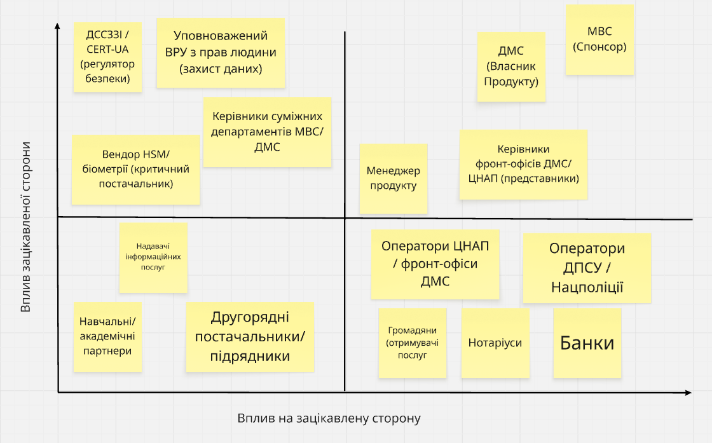

*Рисунок 1.2 – Матриця зацікавлених сторін для проєкту «Єдиний державний демографічний реєстр»*

### Завдання на лабораторну роботу

1. Ознайомитись за шаблоном та правилами формування матриці зацікавлених сторін.
2. Ознайомитися з інтерфейсом та можливостями засобів моделювання (Microsoft Visio, Miro, Diagrams.net, LucidChart).
3. За узгодженням з викладачем обрати варіант завдання (таблиця 1.1) для виконання лабораторної роботи.
4. Сформувати перелік зацікавлених сторін за допомогою техніки мозкового штурму. Особливу увагу приділити визначенню зацікавлених сторін, що відносяться до представників з боку бізнесу та зовнішнім зацікавленим сторонам, в тому числі різним підгрупам споживачів, регуляторам, постачальникам.
5. Побудувати матрицю зацікавлених сторін. Кожен квадрант матриці, окрім квадранту «низький вплив/низький вплив на зацікавлену сторону» має містити щонайменше три зацікавлених сторони.

**Таблиця 1.1. Варіанти завдань**

| № | Назва | Короткий опис |
|---|---|---|
| 1 | Інформаційна система піцерії | Система дозволяє клієнтам піцерії переглядати меню, робити замовлення, оплачувати замовлення онлайн, контролювати доставку замовлення. Працівники піцерії можуть оновлювати інформацію по меню, змінювати стан замовлення, розподіляти замовлення серед кур'єрів. |
| 2 | Система запису в поліклініку | Система дозволяє пацієнтам обирати лікаря та записуватись на прийом до відповідного фахівця. Адміністрація поліклініки контролює завантаження лікарів, розклад їх роботи. |
| 3 | Система обробки звернень клієнтів банку | Система дозволяє клієнтам роздрібного українського банку надсилати звернення з питаннями, скаргами та пропозиціями. Стандартні звернення банку опрацьовуються автоматично за допомогою системи штучного інтелекту. Нестандартні звернення опрацьовуються менеджерами відділу по роботі із замовниками. Опрацювання звернень вибірково перевіряється фахівцями адміністративного відділу. |
| 4 | Система «Розумний будинок» | Програмно-апаратний комплекс «Розумний будинок» призначений для віддаленого керування системами опалення, водопостачання, кондиціонування та захисту, а також автоматизації процесу оплати комунальних послуг завдяки передачі показників лічильників у відповідні системи постачальників комунальних послуг. Система будується на елементній базі Ajax та Samsung. |
| 5 | Система «Розумний холодильник» | Програмно-апаратний комплекс «Smart Fridge» контролює наявність продуктів в холодильнику, термін придатності тощо. У випадку нестачі продуктів холодильник самостійно замовляє продукту у визначених постачальників (мережі супермаркетів, служби доставки) і здійснює онлайн-оплату. Для створення системи використовуються елементи від компанії Philips та LG. |
| 6 | Система книжкового магазину | Система дозволяє купувати паперові та електронні книжки різним категоріям покупців. Система дозволяє співробітникам магазина вести облік товарів, контролювати доставку та оплату замовлень, управляти взаємодією з авторами та видавництвами. |
| 7 | Система міського єдиного електронного квитка | Система забезпечує безготівкову оплату та облік поїздок у громадському транспорті (автобус/трамвай/тролейбус/метро), управління тарифами й пільгами, контроль валідності квитків/проїзних. Містить мобільний застосунок для пасажирів, кабінет перевізника та контролера, інтеграції з банками, валідаторами в транспорті й міськими реєстрами пільгових категорій громадян. |

### Вимоги до звіту

Звіт повинен містити:

– титульний аркуш (додаток 1);
– назву та мету роботи;
– варіант завдання;
– матрицю зацікавлених сторін;
– висновки.

### Контрольні питання

1. Наведіть визначення терміну «бізнес-аналіз» і поясніть його зв'язок з моделлю BACCM (Business Analysis Core Concept Model).
2. Обґрунтуйте важливість проведення аналізу зацікавлених осіб в IT-проєктах.
3. Наведіть стандартні класи зацікавлених сторін в IT-проєктах.
4. Наведіть приклади зацікавлених сторін, які бізнес-аналітик має активно залучати в проведення бізнес-аналітичних робіт, а яких має лише інформувати.
5. Поясніть, чому матриця зацікавлених сторін не передбачає включення в неї конкурентів.
6. По яких характеристиках може бути здійснена класифікація зацікавлених сторін проєкту?

## ЛАБОРАТОРНА РОБОТА №2
### АНАЛІЗ ЗАЦІКАВЛЕНИХ ОСІБ: RACI МАТРИЦЯ

**Мета роботи** – отримати навички проведення аналізу зацікавлених сторін проєкту з використанням техніки «RACI матриця».

### Короткі теоретичні відомості

RACI матриця або матриця відповідальності (англ. Responsibility Assignment Matrix) – техніка бізнес-аналізу, яка дозволяє бізнес-аналітику визначити обов'язки ролей або членів команди, а також задач або доробків, до яких вони будуть залучені. Матриця відповідальності може охоплювати як проєктні задачі з метою узгодження розподілу обов'язків, так і для аналізу бізнес-процесів, які відносяться до області змін або контексту проєкту. RACI – це акронім, що розшифровується як Responsible (Виконавець), Accountable (Відповідальний), Consulted (Консультуючий) та Informed (Поінформований).

Виконавець (Responsible, R) – це людина, яка безпосередньо виконує роботу для виконання завдання. Наприклад, для задачі «Провести технічне співбесіду», технічний експерт, який безпосередньо проводить співбесіду буде виконавцем (R).

Відповідальний (Accountable, A) – це людина, яка несе відповідальність за успішне виконання завдання і приймає рішення. Лише один представник зацікавлених сторін може бути відповідальним (принцип єдиноначальності). Наприклад, для задачі «Провести технічне співбесіду» менеджер з персоналу відповідає за успішну організацію і проведення співбесіди.

Консультуючий (Consulted, C) – це зацікавлена сторона або група зацікавлених сторін, до якої звертаються за порадою або інформацією про завдання. Цей обов'язок часто призначається експертам в предметній галузі. Наприклад, для задачі «Провести технічне співбесіду» менеджер проєкту, для якого шукають співробітника надає інформацію щодо вимог до кандидата на посаду.

Поінформований (Informed, I) – це зацікавлена сторона або група зацікавлених сторін, яку тримають у курсі про перебіг виконання завдання та його результати. Інформований відрізняється від консультуючого тим, що комунікація з ним односпрямована, а з консультуючим йде в обидві сторони. Наприклад, в задачі «Провести технічне співбесіду», рекрутерові, який знайшов кандидата на посаду, маємо повідомити про результати співбесіди.

RACI матриця може бути представлена в двох варіантах.

Перший варіант передбачає, що рядки відповідають задачам, а стовпці містять назви зацікавлених сторін, ролей або посади, в комірках на перетині визначається рівень участь в задачі (R, A, C, I). Приклад для цього варіанту наведений в таблиці 2.1.

**Таблиця 2.1. Шаблон RACI матриці (задачі + ролі)**

| | Роль 1 | Роль 2 | Роль 3 | Роль 4 |
|---|---|---|---|---|
| Задача 1 | R | A | C | I |
| Задача 2 | A | R | - | CI |

Другий варіант передбачає, що рядки відповідають задач, а стовпці відповідають рівню участі в задачі (R, A, C, I). В комірках на перетині зазначаються назви зацікавлені сторін, ролей або посад. Приклад для цього варіанту наведений в таблиці 2.2.

**Таблиця 2.2. Шаблон RACI матриці (задачі + рівень участі)**

| | R | A | C | I |
|---|---|---|---|---|
| Задача 1 | Роль 1 | Роль 2 | Роль 3 | Роль 4 |
| Задача 2 | Роль 2 | Роль 1 | Роль 4 | Роль 4 |

Обидва варіанти дозволяють подати однакову інформацію. Перевагою першого формату є те, що він дозволяє зручно проконтролювати, що в процесі заповнення буде перевірятися участь для кожної зацікавленої сторони/ролі/посади, що включена в матрицю як стовпець. Недоліком є те, що матриця може бути занадто розрідженою. Другий шаблон дозволяє уникнути проблеми з розрідженістю матриці, проте вимагає більшої уваги при заповненні комірок переліком відповідних зацікавлених сторін/ролей/посад.

Можливі комбінації рівнів залучення однієї зацікавленої сторони/ролі/посади в рамках однієї задачі: R+A та C+I.

R+A - це випадок, коли виконавець одночасно є відповідальним за виконання задачі. Доцільність цієї комбінації пояснюється тим, що керівник може брати участь у виконанні робіт. Наприклад, провідний бізнес-аналітик, що безпосередньо залучений до виконання задачі "Виявлення вимог" буде мати рівень залучення R+A, а рядові бізнес-аналітики – тільки R. Якби провідний бізнес-аналітик не був залучений до виконання, то він би був тільки A.

Ще одна можлива комбінація це C+I. Те, що людина консультує або надає інформацію, не означає, що ми її маємо тримати в курсі про хід виконання та результати виконання задачі. З цього випливає, що консультант, якого ми додатково інформуємо про результат, повинен мати C+I.

Розглянемо приклад такої ситуації. Бізнес-аналітик описує певний бізнес-процес відділу. Його консультують два співробітники цього відділу, один з який входить в робочу групу проєкту, а другий просто погодився розповісти по певні тонкощі процесу і не залучений до подальших робіт. Після завершення моделювання, ми інформуємо про результат тільки першого з них, учасника робочої групи. Тоді, перший співробітник буде мати рівень залучення C+I, а другий – лише C.

Приклад RACI матриці «задача + рівень участі»:

<table>
<thead>
<tr><th></th><th>R</th><th>A</th><th>C</th><th>I</th></tr>
</thead>
<tbody>
<tr><td>Розробка архітектури проєкту</td><td>Архітектор</td><td>Архітектор</td><td>Бізнес-аналітик, власник продукту</td><td>Бізнес-аналітик, розробник, фахівець з контролю якості, керівник проєкту</td></tr>
<tr><td>Проєктування UX/UI</td><td>UX/UI дизайнер, бізнес-аналітик</td><td>UX/UI дизайнер</td><td>Архітектор, розробник</td><td>Власник продукту, керівник проєкту, розробник, фахівець з тестування</td></tr>
<tr><td>Налаштування CI/CD</td><td>DevOps</td><td>DevOps</td><td>-</td><td>Керівник проєкту, тестувальник, розробник</td></tr>
<tr><td>Пріоритезація завдань</td><td>Бізнес-аналітик, керівник проєкту, власник продукту</td><td>Власник продукту</td><td>Розробник, тестувальник</td><td>Розробник, тестувальник</td></tr>
</tbody>
</table>

Приклад RACI матриці «задача + роль»:

<table>
<thead>
<tr><th></th><th>Архітектор</th><th>Бізнес-аналітик</th><th>Власник продукту</th><th>Розробник</th><th>Тестувальник</th><th>UX/UI дизайнер</th><th>Керівник проєкту</th><th>DevOps</th></tr>
</thead>
<tbody>
<tr><td>Розробка архітектури проєкту</td><td>A+R</td><td>CI</td><td>CI</td><td>I</td><td>I</td><td>-</td><td>I</td><td>-</td></tr>
<tr><td>Проєктування UX/UI</td><td>C</td><td>R</td><td>I</td><td>I</td><td>I</td><td>A+R</td><td>I</td><td>-</td></tr>
<tr><td>Налаштування CI/CD</td><td>-</td><td>-</td><td>-</td><td>I</td><td>I</td><td>-</td><td>I</td><td>A+R</td></tr>
<tr><td>Пріоритезація завдань</td><td>-</td><td>R</td><td>A+R</td><td>C+I</td><td>C+I</td><td>-</td><td>R</td><td>-</td></tr>
</tbody>
</table>

Порядок створення RACI матриці:

– визначити перелік задач, для яких потрібно розподілити або визначити учасників:

  a) формування переліку може викликати потребу у проведенні декомпозиції наскрізного бізнес-процесу або складної задачі;
  b) для декомпозиції може виникнути потреба у визначенні етапів, кінцевих та проміжних результатів;
  c) при декомпозиції потрібно використовувати однаковий рівень деталізації та уникати надто загальних задач;
  d) перелік задач визначає склад рядків в RACI матриці;

– визначити перелік зацікавлених сторін, що будуть брати участь у виконанні задач;
– проаналізувати ролі та поточні обов'язки зацікавлених сторін, що були визначені на другому етапі;
– визначити для кожної задачі відповідального та виконавця(виконавців):

  a) відповідальний має бути лише один;
  b) виконавців може бути декілька;

– визначити, хто буде консультувати перед виконанням задачі та під час виконання (для задачі консультанти можуть бути відсутні);
– визначити, хто має бути проінформований про хід і результати виконання задачі;
– після завершення заповнення матриці проведіть сесію обговорення разом із зацікавленими особами:

  a) ви маєте забезпечити взаєморозуміння та узгодженість усіх ролей та обов'язків;
  b) перевірка повноти переліку задач та рівномірний розподіл навантаження має критичне значення для успіху проєкту.

В ході роботи над проєктом може виникнути потреба оновлення RACI матриці. Ця потреба може бути викликана кращим розумінням переліку задач, сильних та слабких сторін учасників проєкту, змінами в проєктній команді, змінами в границях проєкту. Регулярна перевірка коректності та актуальності матриці дозволяє підтримувати ефективний розподіл робіт в рамках всього життєвого циклу проєкту.

### Завдання на лабораторну роботу

1. Ознайомитись з шаблоном та правилами формування RACI матриці.
2. Сформувати RACI матрицю, що містить задачі:

  c) планування проєкту;
  d) виявлення вимог;
  e) аналіз вимог;
  f) тестування.

Зацікавлені сторони, що мають бути враховані в матриці: керівник проєкту, бізнес-аналітік, розробник, фахівець з контролю якості, спонсор, кінцевий користувач, фахівець з предметної галузі.

Матриця має бути сформована за варіантом 2 – задачі та рівень участі в проєктних задачах.

### Вимоги до звіту

Звіт повинен містити:

– титульний аркуш (додаток 1);
– назву та мету роботи;
– RACI матрицю для переліку задач із завдання;
– висновки.

### Контрольні питання

1. Для чого бізнес-аналітик може використовувати RACI матрицю?
2. Поясніть переваги та недоліки шаблону «задачі та рівень участі» для RACI матриці.
3. Поясніть переваги та недоліки шаблону «задачі та ролі» для RACI матриці.
4. Поясніть недоцільність використання комбінації A+C та R+I для однієї ролі в рамках однієї задачі.
5. Скільки може бути відповідальних (A) для однієї задачі?
6. Скільки може бути виконавців (R) для однієї задачі?

## ЛАБОРАТОРНА РОБОТА №3
### КАНВА БІЗНЕС-МОДЕЛІ

**Мета роботи** – отримати навички проведення аналізу бізнес-контексту та створення бізнес-моделі в форматі стандартної канви бізнес-моделі та бережливої канви бізнес-моделі.

### Короткі теоретичні відомості

В рамках задачі області знань «Аналіз стратегії» бізнес-аналітик повинен зрозуміти поточну бізнес-модель підприємства, її обмеження та цільові показники та визначити зміни, що є необхідними для вирішення існуючих проблем або реалізації обраних можливостей. Для систематизації інформації щодо того, як підприємство працює на верхньому рівні, а саме як воно створює та надає цінність для його споживачів, а також щодо фінансових потоків, може бути використана техніка канва бізнес-моделі (англ. – Business Model Canvas). Найбільш поширеними шаблонами канви бізнес-моделі є стандартна канва бізнес-моделі та бережлива канва бізнес-моделі (англ. – Lean Model Canvas).

Стандартна канва бізнес-моделі складається з дев'яти блоків (рис. 3.1):

– сегменти клієнтів;
– ціннісна пропозиція;
– канали;
– відносини з клієнтами;
– ключові ресурси;
– ключові види діяльності;
– ключові партнери;
– потоки доходів;
– потоки витрат.

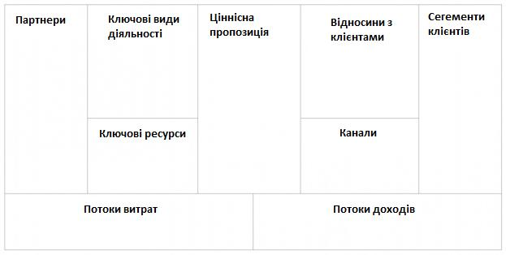

*Рисунок 3.1 – Шаблон стандартної канви бізнес-моделі*

При заповненні стандартної канви бізнес-моделі рекомендується заповнювати розділи в наступному порядку:

– сегменти клієнтів;
– ціннісна пропозиція;
– канали;
– відносини з клієнтами;
– потоки доходів;
– ключові ресурси;
– ключові види діяльності;
– партнери;
– потоки витрат.

Розділ «Сегменти клієнтів» містить інформацію про групи клієнтів із загальними потребами та атрибутами, яких бізнес хоче залучити та обслуговувати в майбутньому. Сегменти можуть бути сформовані, виходячи з:

– різних потреб кожного сегмента;
– відмінностей у прибутковості між сегментами,
– різних каналів дистрибуції,
– формування та підтримання відносин з клієнтами.

У різних бізнес-моделях виділення сегментів клієнтів може здійснюватися по-різному:

– масовий ринок: бізнес-моделі, які стосуються пропозиції товарів широкого споживання, не проводять відмінностей між споживчими сегментами і орієнтовані на велику групу споживачів, об'єднаних подібними потребами;
– вузькоспеціалізований ринок: бізнес-моделі спрямовані на спеціальні споживчі сегменти;
– дробове сегментування: виділяють сегменти ринку, які незначно відрізняються за потребами та запитами;
– багатосторонні сегменти: організації з багатопрофільною бізнес-моделлю, які обслуговують кілька абсолютно різних споживчих сегментів із різними потребами та запитами;
– диверсифіковані сегменти: деякі організації обслуговують два або більше взаємопов'язаних споживчих сегментів, щоб така бізнес-модель працювала, необхідні обидва сегменти. Прикладом може слугувати сегменти компанії Uber: сегмент водіїв, що надають послугу, та сегмент пасажирів, що замовляють послугу.

При заповненні даного розділу бізнес-аналітик може використати наступні питання:

– Для кого створюється продукт чи сервіс?
– Хто є цільовою аудиторією підприємства?
– Хто буде платити за продукт чи сервіс?
– Хто буде шукати вас?

Розділ «Ціннісна пропозиція» містить інформацію про продукти чи сервіси, котрі пропонують цінність для конкретного сегмента клієнтів. Для того, щоб продукт чи сервіс мали цінність для клієнтів, вони мають задовольняти їх потреби і допомагати вирішувати їхню проблему. Ціннісна пропозиція визначає причину, через яку клієнти вибрали саме цю компанію, а не іншу, і купують або користуються її продуктом або сервісом.

Ціннісна пропозиція створює цінність для певного сегменту клієнтів за допомогою об'єднання кількісних або якісних факторів, таких як:

– новизна: деякі ціннісні пропозиції орієнтовані на задоволення абсолютно нових потреб, яких на ринку раніше просто не існувало;
– продуктивність: підвищення ефективності чи продуктивності послуги;
– виготовлення на замовлення: товари та послуги, що задовольняють індивідуальні запити клієнтів або вузькі споживчі сегменти;
– "робити свою роботу": цінність можна створити і за рахунок допомоги клієнту у виконанні його роботи;
– дизайн: дуже важливий елемент, що з великими труднощами піддається оцінці, але який може стати найважливішим елементом ціннісної пропозиції;
– бренд/статус: з точки зору споживача цінність може полягати у демонстрації певного бренда;
– ціна: пропозиція тих же продуктів або сервісів за нижчою ціною - стандартний шлях задоволення запитів, чутливих до цін споживчих сегментів;
– зменшення витрат: допомога споживачам у зниженні їх витрат;
– зниження ризику: зниження рівня ризику, з яким він стикається при купівлі товарів та послуг;
– доступність: зробити товари та послуги доступними для тих груп громадян, які раніше не мали до них доступу;
– зручність/застосовність.

При заповненні даного розділу бізнес-аналітик може використати наступні питання:

– яку саме цінність ваш продукт чи сервіс надає для сегмента клієнтів?
– які проблеми чи задачі сегмента клієнтів вирішується за допомогою продукту чи сервісу?
– які є відмінності від товарів або сервісів, що надають конкуренти?

Розділ «Канали» містить інформацію про способи взаємодії та постачання цінності клієнтам, які використовуються підприємством: канал маркетингу, канал дистрибуції, канал продажів та інші.

Підприємства використовують канали, щоб:

– підвищити обізнаність про свої пропозиції,
– допомогти клієнтам оцінити ціннісні пропозиції,
– дозволити клієнтам придбати товар чи послугу,
– допомогти підприємству доставити ціннісні пропозиції,
– забезпечити підтримку після продажі.

При заповненні даного розділу бізнес-аналітик може використати наступні питання:

– якими каналами комунікації бажають та користуються зараз ваші сегменти клієнтів?
– які канали комунікації є найбільш вигідні та ефективні?

Розділ «Відносини з клієнтами» описує типи відносин, котрі підприємство встановлює з конкретними сегментами клієнтів. Загалом, відносини з клієнтами класифікуються як залучення клієнтів та утримання клієнтів. Методи, що використовуються для встановлення та підтримки відносин з клієнтами, варіюються залежно від бажаного рівня взаємодії та способу комунікації.

Виділяють наступні типи відносин з клієнтами:

– персональна підтримка: клієнт може спілкуватися безпосередньо з представником підприємства, отримуючи від нього допомогу у процесі купівлі та після неї;
– особлива персональна підтримка: у разі представник підприємства на постійний основі закріплений за конкретним клієнтом, з яким в нього складаються свої взаємини;
– самообслуговування: підприємство не підтримує безпосередніх відносин із клієнтами, але забезпечує їх усім необхідним, щоб вони могли обслуговувати себе самостійно;
– автоматизоване обслуговування: поєднання складнішої форми самообслуговування з автоматизацією процесів;
– спільноти: зазвичай цей тип відносин передбачає створення і підтримку онлайн-спільноти, надаючи користувачам можливість обмінюватися знаннями, де взаємодія зі спільнотами допомагає компаніям краще зрозуміти потреби своїх клієнтів;
– співтворчість: підприємство створює цінність спільно зі споживачем, наприклад, залучаючи клієнтів до створення дизайну продуктів або виробництва контенту.

Як приклад співтворчості можна навести продукт «Google maps», який надає можливість користувачам розміщувати фотографії місцевості та залишати відгуки про організації, залучаючи їх до створення контенту.

При заповненні даного розділу бізнес-аналітик може використати наступні питання:

– який тип відносин очікує отримати кожен з ваших клієнтських сегментів?
– які типи відносин є вже встановлені, і які на них є витрати?
– які ваші типи відносин є впроваджені в загальну схему бізнес-моделі?

Розділ «Потоки доходів» містить інформації про шляхи чи способи отримання підприємством доходів від кожного споживчого сегмента в обмін на реалізацію ціннісної пропозиції. Існує два основних способи формування доходу підприємства:

– дохід від разової купівлі товару або послуги;
– дохід, що повторюється, від періодичних платежів за товар, послугу або поточну підтримку.

До видів потоків доходів відносяться:

– продаж: споживач отримує право власності на фізичний продукт;
– плата за користування: споживач сплачує за користування якимось сервісом, чим більше споживач користується сервісом, тим більше за нього сплачує;
– абонентська плата: підписка до сервісу з регулярною платою за нього;
– безкоштовний доступ до базової версії продукту або послуги з оплатою за додаткові функції;
– кредитування, оренда або лізинг: споживач отримує тимчасові права на користування;
– ліцензування: споживач сплачує за дозвіл на використання захищеної інтелектуальної власності;
– оплата за послуги посередника: послуги, які надаються двом або більшій кількості сторін при укладанні угоди;
– реклама: плата від рекламодавця за перегляд реклами якогось продукту чи сервісу.

При заповненні даного розділу бізнес-аналітик може використати наступні питання:

– за яку цінність наші споживачі готові платити, і за що платять зараз?
– яким чином вони платять за продукт чи сервіс?
– яким методам оплати вони б віддали перевагу?
– який є внесок кожного сегменту споживачів до загального доходу компанії?

Розділ «Ключові ресурси» містить опис найважливіших активів, без яких бізнес-модель не може працювати. Ці ресурси необхідні для створення і доставки споживачам ціннісної пропозиції, підтримку зв'язку з ними, генерації потоку доходів.

Ресурси можна класифікувати за:

– матеріально-технічні: виробничі потужності, будівлі, транспорт, обладнання, точки продажу, офіси тощо;
– інтелектуальні: бренди, конфіденційна інформація, патенти, авторські права, база даних клієнтів, база даних партнерів тощо;
– людські: персонал компанії, який має особливо важливу роль у наукомістких виробництвах та творчих колективах;
– фінансові: готівка, кошти на рахунках, відкриті кредитні лінії, фінансові гарантії тощо.

Розділ «Ключові види діяльності» містить опис видів діяльності, які є критичними для створення, постачання та підтримки цінності, а також інші види діяльності, що підтримують роботу підприємства.

Ключові види діяльності можна класифікувати наступним чином:

– додають цінність: види діяльності, за які клієнт готовий платити.
– не додають цінність: аспекти та види діяльності за які споживач не готовий платити.
– не додають цінність, але потрібні для бізнесу: обов'язкові для виконання види діяльності, що виконуються для відповідності регуляторним та іншим вимогам або витрати, пов'язані з веденням бізнесу, за які клієнт не готовий платити (наприклад, бухгалтерський облік).

Прикладами ключових видів діяльності є:

– виробництво: ця діяльність включає розробку або створення продукту в необхідному обсязі та найкращій якості;
– вирішення проблем: ця діяльність полягає у пошуку оптимального вирішення проблем конкретного клієнта.
– платформи/мережі: у бізнес-моделях, що базуються на платформі як ключовому ресурсі, головними видами діяльності є ті, що пов'язані з цією платформою або мережею;
– підтримка користувачів;
– реклама та маркетинг.

Виробнича діяльність є головною для бізнес-моделей компаній-виробників. Вирішення проблем як ключова діяльність переважає у роботі організацій, які надають послуги.

При заповненні даного розділу бізнес-аналітик може використати наступні питання:

– яких ключових видів діяльності бракує ціннісній пропозиції?
– без чого компанія не може існувати?
– що необхідно робити підприємству, щоб постійно покращувати якість продукту чи сервісу?

Розділ «Партнери» містить опис ключових постачальників або партнерів, завдяки яким бізнес-модель успішно працює. Підприємства шукають партнерів для оптимізації своїх бізнес-моделей, зниження ризиків чи отримання доступу необхідних ресурсів.

Існують три основних причини, що спонукають утворювати партнерські відносини:

– оптимізація та економія від масштабу: призначена для оптимізації процесів створення ціннісної пропозиції;
– зниження ризику та невпевненості: партнерство може сприяти зниженню ризиків конкурентного середовища;
– придбання окремих ресурсів та видів діяльності: залучення постачальників, які надають конкретний спектр ресурсів або виконують певні види робіт.

При заповненні даного розділу бізнес-аналітик може використати наступні питання:

– хто є ключовими партнерами підприємства?
– яке партнерство зможе знизити витрати та хто може стати партнером?
– котрі види робіт можна передати партнерам без втрати якості виконаної роботи?
– які ключові ресурси підприємство отримує та реалізовує через партнерів?

Розділ «Потоки витрат» містить опис найбільш суттєвих витрат, котрі потрібні для роботи бізнес-моделі. Потоки витрат можна визначити, відштовхуючись від наявних ключових ресурсів, ключових видів діяльності та партнерів. Підприємства прагнуть скоротити, мінімізувати чи усунути витрати там, де це можливо. Скорочення витрат може збільшити прибутковість організації та дозволити використовувати ці кошти в інших напрямках з метою створення цінності для організації та клієнтів.

За структурою витрати можна розділити такі категорії:

– фіксовані витрати: витрати, що залишаються незмінними незалежно від обсягу товарів чи сервісів;
– змінні витрати: витрати, що змінюються залежно від обсягу товарів чи послуг;
– економія на масштабі: зниження витрат, що відбувається внаслідок збільшення випуску продукції;
– ефект диверсифікації: цю перевагу підприємство отримує у результаті більшого спектра товарів і сервісів, що воно пропонує.

При заповненні даного розділу бізнес-аналітик може використати наступні питання:

– які витрати є найважливішими для нашої бізнес-моделі?
– з набуттям яких ключових ресурсів пов'язані найбільші витрати?
– які ключові види діяльності є самі витратними для бізнесу?

Канва бізнес-моделі не є статичним документом. В рамках виконання проєкту бізнес-аналітик має повертатись до неї, вносити відповідні зміни, оцінювати заплановані фінансові показники з фактичними результатами, використовувати цикл неперервного покращення: спостереження → гіпотеза → експеримент → вимірювання → рішення.

Приклад канви бізнес-моделі наведено на рис. 3.2.

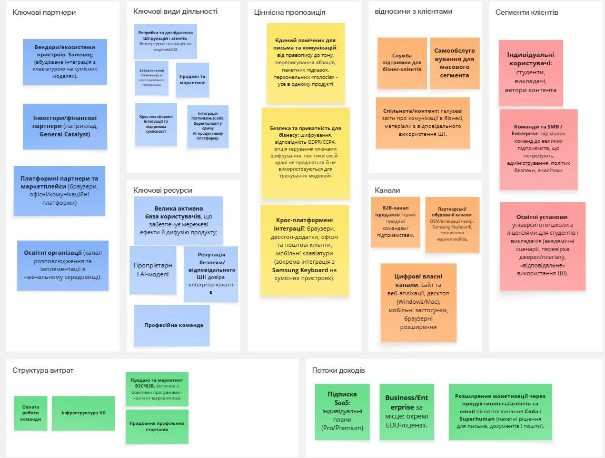

*Рисунок 3.2 – Приклад канви бізнес-моделі для компанії Grammarly*

Якщо стандартна канва бізнес-моделі була розроблена для опису бізнес-моделі існуючих підприємств, то для стартапів частіше використовуються бережлива (Lean) канва, що була розроблена Еш Мауро на базі стандартної канви. Дана модель дозволяє визначити як має виглядати продукт або сервіс на ранній стадії розробки.

Бережлива канва також складається з дев'яти розділів:

– проблеми;

  a) підрозділ: існуючі альтернативи;

– сегменти клієнтів;

  a) підрозділ: ранні послідовники;

– унікальна ціннісна пропозиція;
– рішення;
– канали;
– потоки доходів;
– потоки витрат;
– ключові метрики;
– несправедливі переваги.

Розміщення блоків зображено на рис. 3.3.

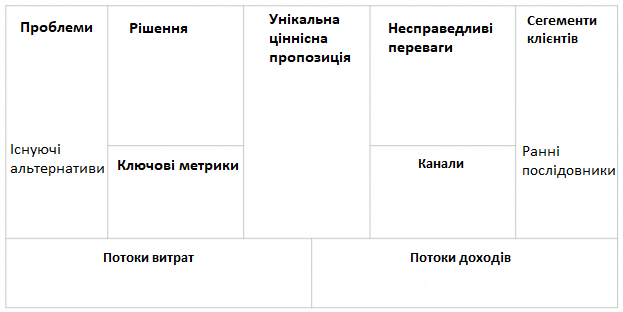

*Рисунок 3.3 – Шаблон бережливої канви*

Розділ «Проблеми» містить інформацію про проблеми, на вирішення яких спрямований продукт або сервіс. В підрозділі «Існуючі альтернативи» вказуються які вже існують способи вирішення зазначених проблем. Якщо альтернативних варіантів рішення немає, це може вказувати на неактуальність проблеми.

При заповненні та перевірці даного розділу бізнес-аналітик може використати наступні питання:

– із зазначеними проблемами стикається велика кількість людей?
– вказані проблеми часто зустрічаються?
– чи можна ігнорувати зазначені проблеми?
– чи готові люди платити гроші за вирішення проблеми?

Альтернативні варіанти рішення необов'язково мають бути прямими конкурентами запропонованого продукту або сервісу. Наприклад, для сервісу Netflix, який спрямований на вирішення проблеми «Зайняти вільний час», альтернативою є кабельне телебачення, комп'ютерні ігри і навіть сон.

Розділ «Сегменти клієнтів» по своєму наповненню відповідає розділу з аналогічною назвою із стандартної канви бізнес-моделі. Відмінність полягає в тому, що цей розділ наповнюється на підставі змісту розділу «Проблеми»: необхідно визначити клієнтів, для яких обрані проблеми є важливими. Ймовірність того, що певний сегмент клієнтів буде готовий платити за продукт або послугу залежить від рівня критичності проблеми. В підрозділ «Ранні послідовники» відносять підмножину клієнтів, які готові працювати з продуктом або сервісом на ранніх етапах, в тому числі з прототипом або бета-версією.

Розділ «Унікальна ціннісна пропозиція» містить максимально короткий та чіткий опис цінності продукту або сервісу для обраного сегменту клієнтів. Зазвичай цей розділ містить одне речення, що пояснює, чому саме ваш продукт варто використовувати клієнтам для вирішення проблеми.

Розділ «Рішення» містить опис ключових функціональних можливостей, сформований на високому рівні. Ці функціональні можливості мають відповідати проблемам, що визначені у відповідному розділі.

При заповненні та перевірці даного розділу бізнес-аналітик може використати наступні питання:

– яка підсистема дозволяє вирішити одну із зазначених проблем?
– чи не є функція зайвою на першому етапі?
– про які функціональні можливості говорили користувачі під час інтерв'ю, фокус-групи?

Зміст розділу «Канали» співпадає з відповідним розділом в стандартній канві бізнес-аналізу. До відмінностей можна віднести, що в бережливій канві більша увага приділяється методикам і каналам просування продукти чи сервіси. Вибір каналів обумовлений як властивостями продукту, так і характеристиками сегментів клієнтів. Наприклад, для різних вікових груп можна використовувати різні соціальні мережі, а в різних країнах можуть відрізнятися найбільш популярні пошукові системи для розміщення контекстної реклами. Також приділяється увага економічної доцільності використання того чи іншого каналу з врахуванням вартості залучення клієнта і пожиттєвої цінності клієнта (англ. *customer lifetime value*, *CLV* або *CLTV*).

Зміст розділу «Потоки доходів» співпадає з відповідним розділом в стандартній канві бізнес-аналізу. Слід зауважити, що популярних підхід залучення інвестицій в стартапи через продаж частини долі власності не відноситься до потоку доходів.

Розділ «Потоки витрат» містить опис основних витрат, потрібних для забезпечення роботи продукту або сервісу. До них відноситься: заробітна плата команди, що створює та підтримує рішення, оренда приміщень, витрати на маркетинг та рекламу, оренда обладнання тощо.

Розділ «Ключові метрики» містить опис метрик, які дозволяють зрозуміти, чи рухається продукт або сервіс до визначених цілей. Набір метрик може змінюватись в залежності від того, на якій фазі життєвого циклу знаходиться продукт. Наприклад, для мобільних застосунків на першому етапі важливою метрикою є кількість завантажень, після цього може цікавити відсоток користувачів, якщо продовжують користуватись застосунком, коефіцієнт утримання клієнтів. Починаючи з певного моменту треба переключитись на фінансові показники: довічна цінність клієнту, вартість залучення клієнту тощо.

Розділ «Несправедливі переваги» містить фактори, які не дозволяють або ускладнюють копіювання ціннісної пропозиції конкурентами. До таких факторів можна віднести:

– інноваційні технології;
– права на інтелектуальну власність;
– базу даних клієнтів;
– ексклюзивні контракти з постачальниками або крупними клієнтами;
– ліцензії або патенти.

Під час заповнення бережливої канви бізнес-аналітик має виконувати перевірки, що підвищують ймовірність успіху продукту або сервісу:

– проблема + сегмент клієнтів + існуючи альтернативи: чи відповідає проблема сегменту клієнтів і як клієнти вирішують її зараз;
– рішення + ранні послідовники + потоки доходів: чи готові ранні послідовники придбати рішення по запланованій ціні;
– унікальна ціннісна пропозиція + канали + потоки доходів: чи дозволяє ціннісна пропозиція нашого продукту або сервісу залучати клієнтів через обрані канали;
– ключові метрики + канали + потоки витрат: чи спроможна бізнес-модель до розвитку в довгостроковому періоді.

Приклад заповнення бережливої канви бізнес-моделі наведено на рис. 3.4.

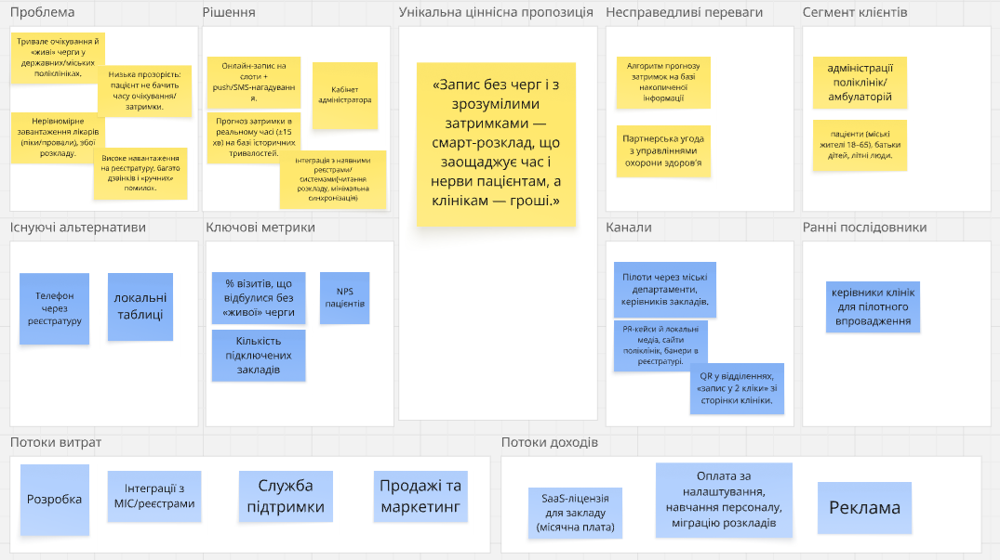

*Рисунок 3.4 – Приклад бережливої канви бізнес-моделі для проєкту «Є-черга для клінік»*

При заповненні бережливої канви бізнес-моделі рекомендується заповнювати розділи в наступному порядку:

– проблеми:

  a) опис проблем
  b) альтернативні варіанти рішення

– сегменти клієнтів:

  a) опис основних категорій клієнтів;
  b) ранні послідовники;

– унікальна ціннісна пропозиція;
– рішення;
– канали;
– потоки доходів;
– потоки витрат;
– ключові метрики;
– несправедливі переваги.

### Завдання на лабораторну роботу

1. Ознайомитись з шаблоном та правилами формування стандартної канви бізнес-моделі
2. Ознайомитись з шаблоном та правилами формування бережливої канви.
3. Сформувати стандартну канву бізнес-моделі або бережливу канву за темою, обраною в лабораторній роботі №1.

### Вимоги до звіту

Звіт повинен містити:

– титульний аркуш (додаток 1);
– назву та мету роботи;
– варіант завдання;
– стандартна канва бізнес-моделі або бережлива канва бізнес-моделі;
– висновки.

### Контрольні питання

1. Для чого використовують стандартну канву бізнес-моделі?
2. З яких розділів складається стандартна канва бізнес-моделі?
3. В чому відмінність бережливої канви від стандартної канви бізнес-моделі?
4. В якій послідовності рекомендовано заповнювати стандартну канву бізнес-моделі?
5. В якій послідовності рекомендовано заповнювати бережливу канву?
6. Які класи ключових ресурсів рекомендовано використовувати в стандартній канві бізнес-моделі?
7. Для чого визначати існуючі альтернативні рішення в бережливій канві бізнес-моделі?

## ЛАБОРАТОРНА РОБОТА №4
### АНАЛІЗ ЗОВНІШНІХ ТА ВНУТРІШНІХ ФАКТОРІВ (SWOT АНАЛІЗ)

**Мета роботи** – отримати навички проведення аналізу зовнішніх та внутрішніх факторів, що впливають на стратегію змін, а також вироблення стратегій, що враховують сукупність внутрішніх і зовнішніх факторів.

### Короткі теоретичні відомості

В рамках задачі області знань «Аналіз стратегії» бізнес-аналітик має проаналізувати поточний стан підприємства, визначити бажаний майбутній стан та стратегію змін, яка дозволить здійснити перехід від поточного стану до майбутнього. Для вирішення цих задач бізнес-аналітик може використати техніку стратегічного планування SWOT аналіз, яка дозволяє:

– оцінити сильні та слабкі сторони, можливості та загрози поточного стану підприємства;
– оцінити сильні та слабкі сторони, можливості та загрози, які майбутній стан міг би використовувати чи пом'якшити;
– прийняти рішення щодо відповідної стратегії зміни.

Абревіатура SWOT складається зі скорочень слів і означає наступне:

– S (Strengths) – сильні сторони:

  a) сюди відносяться унікальні характеристики та переваги, які дають можливість об'єкту дослідження виділятися на тлі конкурентів;
  b) у випадку аналізу підприємства це може бути: налагоджені бізнес-процеси, широка клієнтська база, кваліфікований персонал, наявність значних ресурсів, репутація бренду тощо.

– W (Weaknesses) – слабкі сторони:

  a) до цієї категорії відносяться недоліки, які негативно впливають на об'єкт дослідження.
  b) приклад: відсутність технологій або інструментів, відсутність певних послуг, нестача навичок у персоналу, вузький асортимент, нестача ресурсів тощо.

– O (Opportunities) – можливості:

  a) можливості – це зовнішні фактори, які можуть сприяти досягненню об'єктом дослідження поставлених цілей або отримання конкурентних переваг;
  b) у випадку аналізу підприємства це може бути: вільні ринки збуту, поява нових технологій або кандидатів, які ними володіють, зміна законодавства;
  c) прикладом цього фактор може слугувати поява технології великих мовних моделей, які дозволяють зменшувати витрати завдяки використанню штучного інтелекту.

– T (Threats) – загрози:

  a) до цієї категорії відносяться зовнішні фактори, через які об'єкт дослідження може понести втрати;
  b) прикладом може бути поява сильного конкурента, економічний спад, несприятливі зміни законодавства, фінансова криза, нестабільна ситуація в країні.

Можливий вигляд SWOT матриці наведено на в таблиці 4.1.

**Таблиця 4.1. Шаблон для SWOT аналізу**

| | Корисно | Шкідливо |
|---|---|---|
| **Внутрішні фактори** | Сильні сторони | Слабкі сторони |
| **Зовнішні фактори** | Можливості | Загрози |

Для визначення внутрішніх та зовнішніх факторів організації можна використати наступні питання.

Сильні сторони:

– які особливі вміння є у співробітників організації?
– які унікальні матеріальні та нематеріальні ресурси є у організації?
– які є основні конкурентні переваги організації?
– які переваги мають культура, бренд і репутація організації?

Слабкі сторони:

– що потрібно покращити всередині організації?
– які обмеження або виклики стоять перед організацією?
– що організація робить гірше від своїх конкурентів?
– які недоліки є у культурі, бренді та репутації організації?
– який матеріальних чи нематеріальних ресурсів не вистачає організації для досягнення цілей?

Можливості:

– які є нові тенденції та можливості в галузі, якими може скористатися організація?
– які перспективні напрями існують для розвитку і зростання?
– які є неохоплені ринки збуту?
– які нові технології може використати організація для підвищення своєї продуктивності?
– якими регуляторними змінами може скористатися організація на свою користь?

Загрози:

– які зовнішні фактори або тенденції на ринку становлять загрозу для організації?
– чи є нові або існуючі конкуренти, які можуть вплинути на позицію організації на ринку?
– які регуляторні зміни можуть негативно вплинути на організацію?
– які дії конкурентів можуть погіршити позицію організації на ринку?

На підставі виявлених сильних та слабких сторін, можливостей і загроз бізнес-аналітик може розробити стратегії. Стратегії розбиваються на чотири класи, в залежності від того, з використанням якої пари зовнішніх та внутрішніх факторів, вони побудовані.

Для стратегій класу SO використовуємо сильні сторони для реалізації можливостей. Наприклад, аутсорсінгова компанія має експертизу щодо побудови ефективних процесів розробки програмного забезпечення. На ринку є тенденція побудови внутрішніх підрозділів розробки в крупних компаніях. Стратегія: розширити послуги компанії консалтингом із побудови процесів розробки, допомагаючи клієнтам швидко створювати та масштабувати внутрішні відділи розробки.

Для стратегій класу ST використовуємо сильні сторони для запобігання або зменшення впливу загроз. Наприклад, нові вимоги регулятора в частині захисту персональних даних або кібербезпеки можуть обмежити можливості використання програмного продукту. Компанія має фахівців з кібербезпеки, досвід з реалізації вимог GDPR, досвід проходження аудитів та сертифікацій. Стратегія: увійти в робочу групу по розробці нових регуляторних актів; використовувати експертизі у сфері кібербезпеки для швидкої адаптації під нову нормативну базу.

Для стратегії класу WO використовуємо можливості для уникнення або компенсації слабких сторін. Наприклад, у компанії немає власних експертів з кібербезпеки. На ринку з'явилися постачальники послуги «кібербезпека-як-сервіс». Стратегія: інтегрувати сервіси від постачальників і покращити показники безпеки власник програмних продуктів.

Для стратегії класу WT намагаємось зрозуміти, яким чином організація позбавитись слабких сторін, щоб запобігти загроз. Це сценарії передбачають розгляд найгірших сценаріїв, в тому числі вихід з ринку. Наприклад, продукт побудованих на застарілій монолітній архітектурі, яку складно масштабувати. Клієнти переходять до використання хмарних рішень. Стратегія: поступово згорнути підтримку продукту й сфокусуватися на нішевих рішеннях.

Для зображення стратегій сумісно з зовнішніми та внутрішніми факторами може використовувати шаблон, наведений в таблиці 4.2.

**Таблиця 4.2. Шаблон для SWOT аналізу (Фактори та Стратегії)**

| | Можливості | Загрози |
|---|---|---|
| **Сильні сторони** | SO стратегії | ST стратегії |
| **Слабкі сторони** | WO стратегії | WT стратегії |

Рекомендований порядок проведення SWOT аналізу:

1. Визначити об'єкт дослідження. Це може бути конкретний сервіс або продукт, підрозділ або організація в цілому.
2. Зібрати інформацію про об'єкт дослідження: внутрішнє та зовнішнє середовище, в якому працює/використовується об'єкт дослідження. Дослідити ринок, клієнтів, конкурентів, постачальників та регуляторів.
3. Виявити сильні сторони об'єкту дослідження.
4. Виявити слабкі сторони об'єкту дослідження.
5. Виявити можливості, які сприяють досягненню поставлених бізнес-цілей.
6. Виявити загрози, які можуть ускладнювати або унеможливлювати досягненню поставлених бізнес-цілей.
7. Проаналізувати виявлені внутрішні та зовнішні фактори, знайти паралелі та зв'язки між ними.
8. Розробити стратегії на підставі виявлених внутрішніх та зовнішніх факторів.
9. Оберіть один клас стратегій як основний і один як допоміжний.
10. Пріоритизуйте стратегії з обраних класів та заплануйте їх реалізацію.

### Завдання на лабораторну роботу

1. Ознайомитись з шаблонами та правилами проведення SWOT аналізу.
2. Заповнити шаблон для SWOT аналізу (Фактори та Стратегії) для продукту/сервісу, обраного в лабораторній роботі №1.

### Вимоги до звіту

Звіт повинен містити:

– титульний аркуш (додаток 1);
– назву та мету роботи;
– варіант завдання;
– результати SWOT аналізу;
– висновки.

### Контрольні питання

1. Для чого використовують SWOT аналіз?
2. Як класифікуються фактори, що аналізуються в рамках SWOT?
3. Які класифікуються стратегії в рамках SWOT аналізу?
4. Наведіть приклади зовнішніх факторів, що враховуються в SWOT аналізі.
5. Наведіть приклади внутрішніх факторів, що враховуються в SWOT аналізі.

## ЛАБОРАТОРНА РОБОТА №5
### РЕЄСТР РИЗИКІВ

**Мета роботи** – отримати навички виявлення та керування ризиками, що можуть вплинути на проєктні активності та на успішність впровадження рішення

### Короткі теоретичні відомості

Ризик – це вплив невизначеності на цінність зміни, рішення або підприємства. В рамках задачі області знань «Аналіз стратегії» бізнес-аналітик має проаналізувати ризики, які пов'язані з поточним станом підприємства, бажаним станом та стратегією змін. В більшості випадків в рамках роботи з ризиками зусилля бізнес-аналітика сконцентровані на негативних ризиках, тих що зменшуються цінність, проте ризики можуть бути позитивними, тобто збільшувати цінність. Друга категорія ризиків має назву «можливості» (анг. – opportunity).

Не зважаючи на те, що з проєктними ризиками здебільшого працює керівник проєкту, бізнес-аналітик може:

– управляти ризиками, які безпосередньо пов'язані з його роботою;
– працювати з бізнес-ризиками, що можуть перетворитися на бізнес-вимоги або суттєво вплинути на плани по реалізації рішення/проведення змін на підприємстві.

Для виявлення ризиків використовують експертну оцінку, інтерв'ю, аналіз попереднього досвіду та історичного аналізу схожих ініціатив та проєктів.

Перелік атрибутів, що використовуються при складанні реєстру ризиків наведений в таблиці 5.1

**Таблиця 5.1. Можливі атрибути ризику**

| Атрибут ризику | Пояснення |
|---|---|
| Дата виявлення | Дата, коли ризик був виявлений або доданий до реєстру |
| Звітувач | Особа, яка визначає ризик |
| Джерело | Об'єкт, до якого відноситься ризик: документація, певна ініціатива, епік тощо |
| Вимір | Певний фактор, який може вплинути на час, обсяг або якість продукту. Наприклад:  – Фінанси (контракт): перевищення бюджету, суперечливість у контракті.  – Обсяг – суперечність вимог  – Розклад – затримка в узгодженні  – Якість – помилки в роботі  – EngX (Engineering Experience) – проблема масштабування технології  – Команда (процеси, найм) – низька продуктивність, довгий час на адаптацію для нового працівника.  – Процес: відсутність відгуків від користувачів до запуску. |
| Ефект | Можливий ефект з детальним описом. |
| Стратегія обробки | Уникнути, зменшити, передати або прийняти |
| Вплив | Може бути визначений кількісно: гроші або час. Вплив також може бути визначений якісно: низький, середній, високий. |
| Ймовірність | Вірогідність у відсотках, що ризик може спрацювати, або якісна оцінка: низька, середня, висока. |
| Рівень ризику | Вплив, помножений на ймовірність; найвищий рівень ризику зазвичай передбачає найвищий пріоритет при визначенні стратегії обробки.  Якщо вплив та ймовірність виражені якісно, рівень ризику може бути оцінений згідно підходу, зображеному на Рисунку X. |
| Власник ризику | Особа, відповідальна за вирішення ризику |
| Крайній термін | Дата, до якої команда / відповідальна особа зобов'язується вирішити ризик |
| Статус | Поточний стан ризику на дату |
| Нотатки | Додаткова інформація щодо ризику |
| Термін спостереження за ризиком після вирішення | В деяких випадках корисно повернутись до ризику через певний час після його зменшення або уникнення для додаткового аналізу. |

Для визначення рівня ризику в залежності від рівня ймовірності та впливу, що визначені через якісні шкалу оцінки, можна використовувати підхід, описаний в таблиці 5.2.

**Таблиця 5.2. Визначення рівня ризику в залежності від ймовірності та впливу**

| Вплив \\ Ймовірність | Низька | Середня | Висока |
|---|---|---|---|
| **Низький** | Середній рівень | Високий рівень | Високий рівень |
| **Середній** | Низький рівень | Середній рівень | Високий рівень |
| **Високий** | Низький рівень | Низький рівень | Середній рівень |

Для ризиків із середнім та високим рівнем розглядаються можливості по модифікації ризику:

– уникнути: усувається джерело ризику, або плани коригуються так, щоб унеможливити настання ризику;
– передати: відповідальність за роботу з ризиком частково або повністю передається третій стороні;
– пом'якшити: зменшити ймовірність виникнення ризику або можливі негативні наслідки, якщо ризик все ж таки спрацьовує;
– прийняти: приймається рішення нічого не робити з ризиком, а відповідь на ризик вироблятиметься, коли він станеться.

У випадку пом'якшення ризику обраховується залишковий рівень ризику. Залишковий рівень розраховується як добуток зменшених значень впливу та ймовірності. Також може виконуватися аналіз витрат і вигід, щоб визначити, чи виправдовує зменшення ризику вартість та зусилля вжитих для цього заходів. Ризики можуть переглядатися у термінах залишкового ризику.

Скорочена версія реєстру ризиків має включати в себе:

– опис ризику;
– вплив;
– ймовірність;
– рівень ризику;
– план по модифікації ризику;
– власник ризику;
– ймовірність залишкового ризику;
– вплив залишкового ризику;
– рівень залишкового ризику.

Ризики пріоретизуються відповідно до їх рівня. Ризикам, які можуть статися в найближчому майбутньому, можуть призначати вищий пріоритет, ніж тим, настання яких очікується пізніше. Ризикам деяких категорій, таких як репутація чи відповідність нормативним вимогам, може призначатися більший пріоритет, ніж іншим.

Рекомендований порядок заповнення реєстру ризиків:

1. Виявити можливі ризики шляхом проведення мозкового штурму.
2. Для кожного ризику виявити його початкові характеристики:

  a) опис ризику;
  b) наслідки ризику;
  c) ймовірність;
  d) вплив;
  e) рівень.

3. Пріоретизувати ризики відповідно до рівня.
4. Визначити ризики, для яких можлива та доцільна модифікація.
5. Визначити підхід до модифікації ризику.
6. Для ризиків, які будуть модифікуватись через зменшення, передачу або уникнення, описати детальний план модифікації ризику та визначити власника ризику.
7. Визначити параметри залишкового ризику: ймовірність, вплив, рівень.

### Завдання на лабораторну роботу

1. Ознайомитись з правилами проведення аналізу ризиків.
2. Заповнити реєстр ризиків для проєкту по створенню продукту/сервісу, обраного в лабораторній роботі №1. Приклад заповненої таблиці ризиків наведено в таблиці 5.3.
3. Реєстр має містити щонайменше п'ять ризиків з повністю заповненою інформацією про початкові показники: ймовірність, вплив, рівень.
4. Для щонайменше двох ризиків необхідно розробити план по модифікації, що забезпечує зменшення ймовірності або впливу ризику.

### Вимоги до звіту

Звіт повинен містити:

– титульний аркуш (додаток 1);
– назву та мету роботи;
– варіант завдання;
– реєстр ризиків;
– висновки.

### Контрольні питання

1. Що таке ризик?
2. Що таке залишковий ризик?
3. З якими ризиками найчастіше працює бізнес-аналітик?
4. Які існують стратегії для модифікації ризику?
5. В яких випадках бізнес-аналітик може рекомендувати прийняти ризик?
6. Як визначається рівень ризику?

**Таблиця 5.3. Приклад реєстру ризиків**

<table>
<thead>
<tr><th rowspan="2">№</th><th colspan="2" style="text-align:center">Вихідний ризик / Первинний ризик</th><th colspan="3" style="text-align:center">Первинний ризик</th><th rowspan="2">План по модифікації ризику</th><th rowspan="2">Власник ризику</th><th colspan="3" style="text-align:center">Залишковий ризик</th></tr>
<tr><th>Опис ризику</th><th>Наслідки ризику</th><th>Ймовірність</th><th>Вплив</th><th>Рівень</th><th>Ймовірність</th><th>Вплив</th><th>Рівень</th></tr>
</thead>
<tbody>
<tr><td>1</td><td>Неможливість реалізувати функціонал керування віртуальним балансом в додатку через регуляторні ризики</td><td>функціональність додатку буде не повною, що може призвести до втрати певної групи користувачів і відповідно на прибуток та вірогідність чи темпи повернення інвестицій</td><td>0.20</td><td>40</td><td>8</td><td>Приймаємо</td><td></td><td>0.20</td><td>40</td><td>8</td></tr>
<tr><td>2</td><td>Сильний гравець на ринку вийде з аналогічним проєктом</td><td>наш продукт може не витримати конкуренції, інвестиції не будуть повернуті через кількість транзакцій меншу за очікувану</td><td>0.20</td><td>80</td><td>16</td><td>Приймаємо</td><td></td><td>0.20</td><td>40</td><td>8</td></tr>
<tr><td>3</td><td>Не вистачить інвестицій на реалізацію MVP застосунку (розробка + вихід на ринок)</td><td>зупинка проєкту, повна втрата інвестицій</td><td>0.80</td><td>100</td><td>80</td><td>Детально розписати границі і здійснити пріоритезацію функції. Використовувати проміжні зрізи з оцінкою готовності продукту. Запланувати використання малобюджетних каналів просування додатку. В першу чергу залучити додаткових інвесторів</td><td>Бізнес-аналітик</td><td>0.35</td><td>100</td><td>35</td></tr>
<tr><td>4</td><td>Ексклюзивний партнер розірве контракт</td><td>втрата прибутку від реклами партнера; втрата основного каналу просування застосунку</td><td>0.50</td><td>70</td><td>35</td><td>Прописати контракт таким чином, щоб партнер був зацікавленим в його дотриманні та продовженні. Залучити інших партнерів. Розширити кількість каналів просування продукту</td><td>Керівник проєкту</td><td>0.2</td><td>50</td><td>10</td></tr>
<tr><td>5</td><td>Партнери (ресторани) не погодяться на співпрацю</td><td>Це вплине на кількість користувачів і відповідно на прибуток та вірогідність чи темпи повернення інвестицій</td><td>0.80</td><td>30</td><td>24</td><td>Змінити пропозицію партнерам. Розширити кількість сегментів можливих партнерів. Йти з тими партнерами які погодяться і потім спробувати з іншими партнерами)</td><td>Власник продукту</td><td>0.6</td><td>20</td><td>12</td></tr>
</tbody>
</table>

## ЛАБОРАТОРНА РОБОТА №6
### СЦЕНАРІЇ АТРИБУТІВ ЯКОСТІ

**Мета роботи** – отримати навички виявлення та документування нефункціональних вимог в форматі сценаріїв атрибутів якості

### Короткі теоретичні відомості

Нефункціональні вимоги описують умови, за яких рішення має залишатися ефективним, або якості, які рішення повинно мати. В літературі нефункціональні вимоги також називають критеріями якості програмного забезпечення або вимогами до якості. Даний клас вимог доповнює функціональні вимоги, визначає обмеження для цих вимог або описує атрибути якості рішення в цілому.

В літературі та професійних стандартах можна знайти різні підходи до класифікації нефункціональних вимог [3-5]. Керівництво до зводу знань з бізнес-аналізу від Міжнародного інститут бізнес-аналізу [3] пропонує наступну класифікацію:

– доступність (availability);
– портативність (portability);
– вимоги до сертифікації (certification);
– сумісність (compatibility);
– надійність (reliability);
– відповідність законодавству (compliance);
– масштабованість (scalability);
– локалізація (localization);
– ремонтопридатність (maintainability);
– безпека (security);
– угоди про рівень обслуговування (service level agreements);
– продуктивність (performance);
– юзабіліті (usability);
– обмеження (constraints);
– розширюваність (extensibility).

Найчастіше в IT-проєктах бізнес-аналітики виявляють, аналізують та документують наступні класи нефункціональних вимог [12]:

– доступність;
– продуктивність;
– обмеження;
– безпека;
– масштабованість.

Доступність (availability) це відношення загального часу, коли рішення перебуває у працездатному стані, до часу експлуатації.

Також може бути визначений через:

– максимально допустимий час простою системи;
– середній час між відмовами;
– середній час ремонту.

Продуктивність (performance) визначається у термінах:

– кількості одночасно працюючих користувачів;
– транзакцій, що обслуговуються;
– часу реакції системи;
– тривалості обчислень;
– швидкості та пропускної спроможності каналів зв'язку.

Обмеження (constraints) можуть стосуватись:

– параметрів системи

  a) кількість серверів;
  b) кількість процесорів;
  c) розмір оперативної пам'яті;
  d) дискові підсистеми;
  e) пропускна здатність мережі;

– мов програмування;
– фреймворків;
– баз даних (кількість записів того чи іншого виду, наприклад, кількість позицій на складі або число рахунків у банківській системі чи кількість полісів у страховій системі);
– систем керування базами даних;
– апаратного забезпечення;
– операційних систем.

Безпека (security) може включати в себе:

– вимоги до обмеження доступу:

  a) по функціям;
  b) по даним;

– вимоги до роботи з приватними або персональними даними.

Масштабованість (scalability) вимірює здатність системи справлятися зі збільшенням робочого навантаження (збільшувати свою продуктивність) при додаванні ресурсів (зазвичай апаратних). Система називається масштабованою, якщо вона збільшує продуктивність пропорційно доданим ресурсам (що ближче до 1, тим вищий показник масштабованості).

Вертикальне масштабування – це збільшення продуктивності кожного компонента системи з метою підвищення загальної продуктивності.

Горизонтальне масштабування – це розбиття системи на дрібніші структурні компоненти і рознесення їх по окремих фізичних машинах (або їх групах), і (або) збільшення кількості серверів, що паралельно виконують одну і ту ж функцію.

При визначенні вимог до масштабованості важливу роль відіграє розуміння стратегії розвитку компанії:

– плани по випуску нових продуктів;
– плани по зростанню клієнтської бази;
– плани по виходу на нові ринки.

Сценарій атрибутів якості (quality attribute scenario) це техніка, що дозволяє в структурованому стандартизованому вигляді описувати нефункціональні вимоги різних класів. Сценарій атрибутів якості містить наступні елементи:

– джерело стимулу – це якийсь суб'єкт (людина, система чи будь-яка інша сутність), яка породжує стимул;
– стимул – явище, що спостерігається в системи і вимагає себе уваги;
– умови виникнення стимулу (наприклад, система може перебувати у стані підвищеного навантаження або працювати у звичайному режимі);
– артефакт, що є об'єктом впливу, в якості якого може бути як система загалом, так і її окремі елементи;
– реакція – дія, вжита у відповідь на появу стимулу;
– кількісна міра реакції.

Дія, що виконуються як відповідь на стимул, повинні бути вимірювана, оскільки тільки в цьому випадку відповідність вимогі можна перевірити. Загальна елементів сценарію атрибутів якості наведена в таблиці 6.1.

**Таблиця 6.1. Загальна схема сценарію атрибутів якості**

| Елемент сценарію | Можливі значення |
|---|---|
| Джерело стимулу | Ряд незалежних джерел, частина з яких може перебувати всередині системи |
| Стимул | Періодичне, непериодичне, випадкове надходження подій |
| Умова | Нормальний режим, перевантажений режим |
| Артефакт | Система |
| Реакція | Обробка стимулів, зміна рівня обслуговування |
| Кількісна міра реакції | Затримка, граничний термін, пропускна здатність, втрата даних, нестійкість |

При написанні нефункціональних вимог за схемою сценаріїв атрибутів якості порядок елементів може бути довільним, але кожен з них має бути визначеним.

Розглянемо приклади сценаріїв атрибуту якості.

Приклад 1. Табличне представлення

| Елемент сценарію | Значення |
|---|---|
| Джерело стимулу | Білінгова система |
| Стимул | Некоректна відповідь |
| Умова | Штатний режим |
| Артефакт | Підсистема відстежування доступу до матеріалів |
| Реакція | Зберігає отриману відповідь, відбувається інформування технічного адміністратора, підсистема відстежування доступу до матеріалів доступна та працює без простоїв. |
| Кількісна міра реакції | Інформування технічного адміністратора протягом 2 секунд |

Приклад 1. Текстове представлення

Підсистема відстежування доступу до матеріалів, при штатному режимі роботи, отримує від білінгової системи некоректну відповідь. Система зберігає отриману відповідь, відбувається інформування технічного адміністратора протягом 2 секунд, підсистема відстежування доступу до матеріалів доступна та працює без простоїв.

Приклад 2. Табличне представлення

| Елемент сценарію | Значення |
|---|---|
| Джерело стимулу | Інтернет |
| Стимул | Одночасна атака 1000 неавторизованих осіб для отримання платіжних даних користувачів. |
| Умова | Штатний режим |
| Артефакт | Система |
| Реакція | Повідомляє адміністратору системи про ситуацію, зберігає протокол роботи, перемикається в режим «offline». |
| Кількісна міра реакції | Повідомлення адміністратора протягом 10 секунд; перехід в режим «offline» протягом 20 секунд. |

Приклад 2. Текстове представлення

Під час звичайної роботи системи відбувається одночасна атака 1000 неавторизованих осіб через інтернет для отримання платіжних даних користувачів. Система повідомляє адміністратору системи протягом 10 секунд, зберігає протокол роботи, перемикається в режим «offline» протягом 20 секунд.

Приклад 3. Текстове представлення

Користувач на платформі створення презентацій в профілі вибрав доступну для редагування презентацію та перейшов в редактор презентації і отримав сповіщення протягом 5 секунд, що презентацію редагує ще один користувач.

Приклад 4. Текстове представлення

Новий користувач успішно зареєструвався та авторизувався в конструкторі презентацій. Система підказує клієнту, використовуючи покрокову інструкцію по створенню нової презентації та проводить по основному функціоналу створення та збереження презентації. Система призводить до створення презентації за 15 кроків.

Приклад 5. Текстове представлення

Неавторизований користувач отримує доступ до системи протягом робочого часу та намагається завантажити дані користувача. Система виявляє зловмисну поведінку, зберігає журнал неавторизованих дій особи та надсилає сповіщення до служби підтримки протягом 20 секунд.

Наведені приклади показуються, що таблична форма є більш громіздкою, тому в більшості випадків вона застосовується виключено для перевірки повноти опису нефункціональних вимог.

### Завдання на лабораторну роботу

1. Ознайомитись з класифікацією нефункціональних вимог.
2. Ознайомитись з форматом описання нефункціональних вимог «Сценарій атрибутів якості»
5. Сформулювати десять нефункціональних вимог, з них щонайменше п'ять за форматом «Сценарій атрибутів якості», для проєкту по створенню продукту/сервісу, обраного в лабораторній роботі №1.

### Вимоги до звіту

Звіт повинен містити:

– титульний аркуш (додаток 1);
– назву та мету роботи;
– варіант завдання;
– перелік нефункціональних вимог;
– висновки.

### Контрольні питання

1. Що таке нефункціональна вимоги?
2. З яких елементів складається сценарій атрибутів якості?
3. Які характеристики системи визначають нефункціональні вимоги класу «Доступність»?
4. Які елементи атрибутів якості є обов'язковими?

## ЛАБОРАТОРНА РОБОТА №7
### МОДЕЛЮВАННЯ БІЗНЕС-ПРОЦЕСІВ В НОТАЦІЇ BPMN 2.0

**Мета роботи** – отримати навички моделювання бізнес-процесів з використанням нотації BPMN 2.0

### Короткі теоретичні відомості

BPMN (англ. Business Process Model and Notation, модель та нотація бізнес-процесів) визначає графічну нотацію, структуру даних для збереження моделі бізнес-процесу та формат файлу для збереження моделі бізнес-процесу. Перша версія нотації BPMN була розроблена в 2004 році Business Process Management Initiative (BPMI). В 2005 році BPMI стала частиною консорціуму OMG (Object Management Group). Остання версія BPMN – 2.0.2, що була опублікована в січні 2014 року.

Основна мета BPMN – створення стандартної нотації, зрозумілої всім бізнес-користувачам: бізнес-аналітикам, що створюють та покращують процеси; технічним фахівцям, які відповідають за реалізацію процесів та менеджерам, які стежать за процесами та керують ними. Таким чином BPMN служить сполучною ланкою між фазою дизайну бізнес-процесу та фазою його реалізації. До переваг цієї нотації можна віднести:

– забезпечення комунікації "замовник-аналітик" при виявленні, аналіз, обговоренні та затвердженні вимог;
– багата палітра елементів, що дозволяють точно передати деталі бізнес-процесу;
– нейтральність по відношенню до методології;
– можливість визначення послідовності кроків у процесі (на відміну від IDEF0) та міжпроцесна взаємодія;
– можливість виконання моделі за рахунок використання BPMN-рушія (наприклад, Flowable, Camunda, Bizagi BPMN Suite тощо).

До основних елементів нотації BPMN відносяться:

– задачі;
– шлюзи;
– події;
– потоки подій, повідомлень та інформації;
– пул;
– доріжка;
– об'єкт даних;
– сховище даних.

Задачі зображуються у вигляді прямокутника із заокругленими кутами (рис. 7.1). З точки зору моделі задача є шагом процесу, з точки користувача задача є завданням в рамках виконання процесу.

*Рисунок 7.1 – Елемент «Задача»*

Шлюзи зображуються у вигляді ромба (рис. 7.2). Шлюзи дозволяють визначати варіативність виконання задач бізнес-процесу на підставі даних процесу та подій.

*Рисунок 7.2 – Елемент «Шлюз»*

Події зображуються у вигляді круга (рис. 7.3). Події поділяються на стартові (кодифікуються кругом з одинарною границею), проміжні (кодифікуються кругом, обмеженим двома концентричними колами) та кінцеві (кодифікуються кругом з товстою границею).

*Рисунок 7.3 – Елемент «Подія»*

Потік, що з'єднує задачі, шлюзи та події називають потоком керування. Він зображується у вигляді неперервної стрілки (рис. 7.4). Потік подій визначає послідовність виконання задач в рамках потоку робіт.

*Рисунок 7.4 – Елемент «Потік керування»*

Потік повідомлень, що з'єднує процеси або спеціалізовані події/задачі різних процесів зображується у вигляді рискової лінії, що має направлення (рис. 7.5). Використовується для передачі сигналів або інформації між потоками робіт.

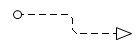

*Рисунок 7.5. Елемент «Потік повідомлень»*

Потік інформації, що з'єднує задачі та сховища даних або документи, зображується у вигляді лінії з крапок (рис. 7.6).

*Рисунок 7.6 – Елемент «Потік інформації»*

Пул визначає границі процесу або зовнішню відносно процесу, який моделюється, сутність (організацію, клієнта, регулятора тощо). Кожен процес повинен мати назву, за можливість унікальну в рамках моделі (рис. 7.7).

*Рисунок 7.7 – Елемент «Пул»*

Доріжка визначає виконавця в рамках пулу. Доріжка завжди належить до одного і лише одного пулу. Кожна доріжка повинна мати назву, унікальну в рамках пулу (рис. 7.8).

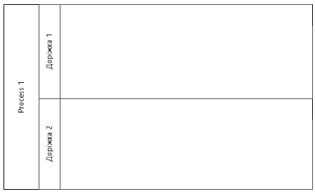

*Рисунок 7.8 – Елемент «Пул з доріжками»*

Сховище даних, з якого дані отримуються або в яке дані передаються в рамках виконання задач процесу зображується у вигляді циліндра (рис. 7.9).

*Рисунок 7.9 – Елемент «Сховище даних»*

Об'єкт даних, який створюється в рамках виконання задач процесу, зображується у вигляді листа із загнутим кутом (рис. 7.10).

*Рисунок 7.10 – Елемент «Об'єкт даних»*

Нотація BPMN включає в себе типізацію задач, що дозволяє при моделюванні бізнес-процесів передати додаткову інформацію щодо специфіки виконання задачі:

Користувацька (User) – це задача, яка виконується користувачем у системі (наприклад, зареєструвати задачу в Jira, заповнити форму заявки на відпустку в корпоративному порталі, ввести дані про оплату від клієнта в CRM).

Ручна (Manual) – це задача, яка виконується користувачем поза межами системи (зателефонувати замовнику, провести інвентаризацію товару на складі, підписати паперовий контракт із замовником).

Сервісна (Service) – це задача, що виконується за допомогою зовнішньої програми або сервісу (наприклад, розрахувати довжину маршруту за допомогою відкритого сервісу Google Map, автоматично відправити SMS-повідомлення через інтеграцію з Twilio).

Скриптова (Script) – це задача, яка виконується автоматично за допомогою функції автоматизованої системи (наприклад, розрахувати рейтинг клієнта, автоматично обчислити знижку для клієнта за програмою лояльності; розрахувати розмір податку на додану вартість).

Відправка (Send) – це задача, яка полягає у відправці інформаційного повідомлення в інший процес або зовнішньому відносного процесу контрагента (наприклад, відправити push-сповіщення в мобільний застосунок користувача, надіслати повідомлення іншому процесу про завершення етапу тестування; відправити повідомлення про завершення процесу).

Отримання (Receive) – це задача, яка полягає в очікуванні надходження інформаційного повідомлення від іншого процесу або зовнішнього відносного процесу контрагента (наприклад, отримати підтвердження по старту робіт, отримати відмову від комерційної пропозиції).

Бізнес-правило (Business Rule) – це задача, що полягає у прийнятті рішення на підставі бізнес-правил довільної структури (наприклад, визначити категорію клієнта (VIP/стандартний) за набором критеріїв, розрахувати митні збори залежно від країни постачання).

До шлюзів (gateways), що керуються даними процесу відносяться:

– Ексклюзивний шлюз: зображується у вигляді порожнього ромба або ромба із символом «X» (рис. 7.11);

*Рисунок 7.11 – Ексклюзивний шлюз*

– Паралельний шлюз: зображується у вигляді ромба із символом «+» (рис. 7.12);

*Рисунок 7.12 – Паралельний шлюз*

– Інклюзивний шлюз: зображується у вигляді ромба із вписаним колом (рис. 7.13);

*Рисунок 7.13 – Інклюзивний шлюз*

– Комплексний шлюз: зображується у вигляді ромба із символом «*» (рис. 7.14);

*Рисунок 7.14 – Комплексний шлюз*

Всі шлюзи, що керуються даними, можуть використовуватись для роз'єднання (мати один вхід і декілька виходів) або об'єднання (мати декілька входів і один вихід) потоків керування. Згідно з рекомендаціями фахівців один шлюз не може одночасно використовуватись для об'єднання та роз'єднання потоків.

Якщо ексклюзивний шлюз використовується для роз'єднання потоків, для всіх вихідних потоків необхідно визначити логічні вирази таким чином, щоб істинним міг бути вираз лише по одному виходу. Відповідальність за забезпечення виконання цієї умови покладається на автора діаграми і, як правило, не може бути перевірена з використанням вбудованих механізмів верифікації інструментів моделювання. Таким чином, за результатом перевірки логічного виразу токен екземпляру процесу рухається по одній гілці, для якої логічний вираз має значення «True». Для уникнення випадків, коли процес зупиняється внаслідок того, що для жодної гілки логічний вираз не має значення «True», може бути визначений додатковий вихідний потік, який називається «вихід по замовчанню» і позначається символом «/» (рис. 7.15). Для виходу по замовчанню логічний вираз не задається. Токен екземпляру процесу йде по цьому виходу лише в тому випадку, коли для всіх інших гілок логічний вираз має значення, відмінні від «True».

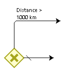

*Рисунок 7.15 – Ексклюзивний шлюз з двома виходами*

Ексклюзивний шлюз також може використовуватись для об'єднання потоків. В такому випадку шлюз пропускає токен, що прийшов до нього без затримки, умови не застосовуються. Найчастіше об'єднуючий ексклюзивний шлюз використовується для об'єднання декількох потоків, які були утворені з використанням ексклюзивного шлюзу (рис. 7.16).

Паралельний шлюз, який використовується для роз'єднання потоку керування, активує всі вихідні гілки. Таким чином токен екземпляру процесу рухається по всіх вихідних гілках одночасно. Використання потоку з позначкою «вихід по замовчанню» не передбачено.

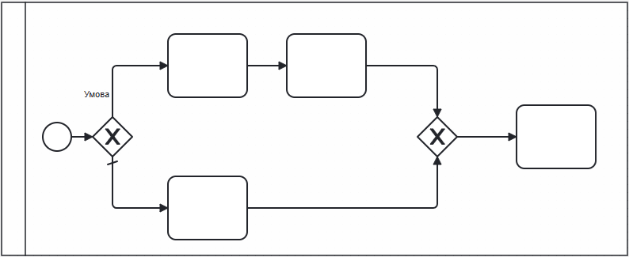

*Рисунок 7.16 – Використання ексклюзивного шлюзу для роз'єднання та об'єднання потоків*

Паралельний шлюз, який використовується для об'єднання потоків керування використовується з метою синхронізації. Шлюз чекає, доки по всіх вхідних гілках прийдуть токени, після цього він об'єднує ці токени в один і пропускає його далі. Якщо хоча б по одній гілці токен не прийде, то процес зупиниться. В більшості випадків, паралельний шлюзи використовуються в парах: спочатку процес в потрібному місці розділяється на два або більше потоків, що виконуються паралельно, а потім ці потоки синхронізуються в один (рис. 7.17).

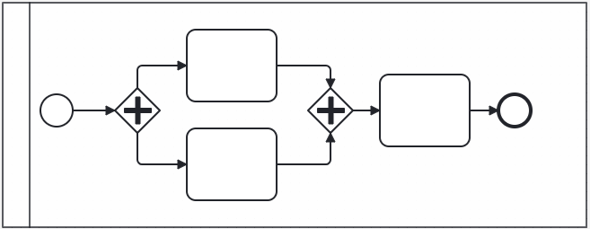

*Рисунок 7.17 – Приклад послідовного використання паралельних шлюзів для роз'єднання та синхронізації потоків*

Також можливий випадок, коли кожен з потоків, що були створені з використанням паралельного шлюзу, закінчуються окремою кінцевою подією (рис. 7.18).

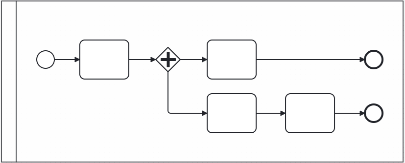

*Рисунок 7.18 – Приклад використання паралельного шлюзу без подальшої синхронізації потоків*

Якщо для синхронізації потоків, що були утворені з використанням паралельного шлюзу, використати ексклюзивний шлюз, то всі задачі, що йдуть після ексклюзивного шлюзу будуть виконуватись декілька разів (відповідно до кількості токенів, що були утворені на паралельному шлюзі). В більшості випадків це не буде відповідати реальним практикам виконання задач в рамках процесу.

Якщо для об'єднання потоків, що були утворені з використанням ексклюзивного шлюзу, використати паралельний шлюз, то процес зупиниться, оскільки на паралельний шлюз в рамках одного екземпляру процесу буде приходити лише один токен.

Інклюзивний шлюз, який використовується для роз'єднання потоків, передбачає наявність логічного виразу для кожної гілки. При цьому, на відміну від ексклюзивного шлюзу, логічні вирази можуть бути істинними одночасно для декількох гілок. За результатом перевірки логічних виразів токен екземпляру процесу рухається по всіх гілках, для яких логічний вираз має значення «True». Поведінка вихідного потоку з відміткою «вихід по замовчанню» аналогічна його поведінці для ексклюзивного шлюзу. Ситуація, коли токен рухається одночасно по «виходу по замовчанню» та гілці з логічним виразом, є неможливою.

Інклюзивний шлюз, який використовується для об'єднання потоків, не передбачає наявності логічного виразу для кожної гілки. Інклюзивний шлюз працює подібно до паралельного, проте він чекає надходження токенів лише по тих гілках, по яких вони можуть прийти згідно з логікою виконання екземпляру бізнес-процесу, об'єднує їх в один і пропускає далі. Це забезпечує більшу гнучкість при використання інклюзивного шлюзу для об'єднання потоків. В загальному випадку, інклюзивний шлюз може замінити паралельний шлюз при об'єднанні декількох потоків, проте це робить діаграму більш складною для сприйняття читачем. Найбільш частим варіантом є використання інклюзивних шлюзі в парі: перший шлюз роз'єднує потік, другий шлюз синхронізує декілька потоків (рис. 7.19).

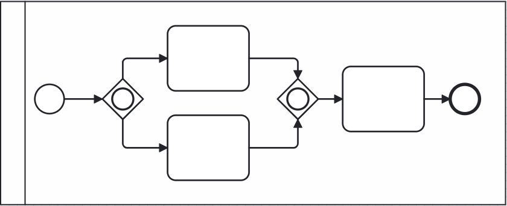

*Рисунок 7.19 – Приклад використання інклюзивного шлюзу для розділення та об'єднання потоків*

Комплексний шлюз може використовуватись як для розділення, так і для об'єднання потоків. Правила його роботи задаються автором діаграми і вказуються з використанням елементу «коментар» (рис. 7.20).

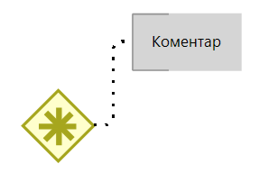

*Рисунок 7.20 – Комплексний шлюз*

Цей шлюз можна використовувати, коли треба показати складну логіку поведінки процесу, яка не може бути передана з використанням стандартних шлюзів. Наприклад, шлюз має очікувати два токени, після цього об'єднати їх в один і пропустити далі, а третій токен має бути проігнорований. Приклад такого процесу наведений на рисунку 7.21. Слід зазначити, що використання комплексного шлюзу ускладнює сприйняття діаграм читачами, а при використанні BPMN платформ для автоматичного виконання діаграм поведінку цього шлюзу потрібно буде програмувати окремо, на відміну від поведінки інших стандартних шлюзів.

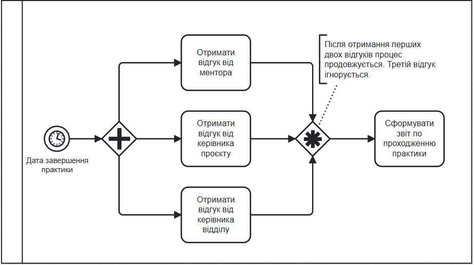

*Рисунок 7.21 – Приклад використання комплексного шлюзу для об'єднання потоків*

Окрім шлюзів, що керуються даними, нотація містить шлюз, що керується подіями (рис. 7.22).

*Рисунок 7.22 – Шлюз по подіях*

Його відмінність полягає в наступному:

– даний тип шлюзу використовується тільки для розділення потоку керування;
– поведінка шлюзу керується не даними, а подіями, що йдуть після шлюзу;
– після цього шлюзу мають тільки типізована задача «Отримання повідомлення» або проміжні події:

  a) отримання повідомлення;
  b) таймер;
  c) отримання сигналу;
  d) умовна подія.

Токен, що прийшов на шлюз по подіях чекає на настання першої події з тих, що йдуть за шлюзом (рис. 7.23). При спрацьовування події, токен рухається по відповідному потоку керування. Всі інші події, що йдуть після шлюзу, ігноруються.

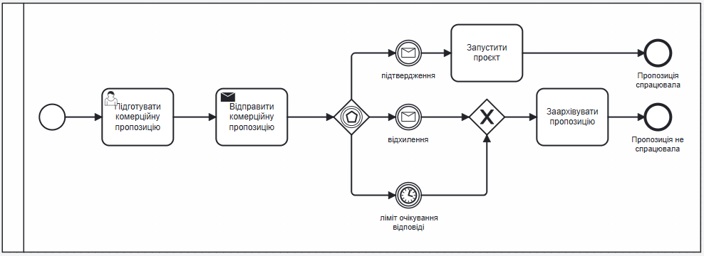

*Рисунок 7.23 – Приклад використання шлюзу по подіях*

Події в BPMN – це елементи, які визначають початок, завершення або проміжні моменти в рамках виконання бізнес-процесу, які стають причиною або наслідком виконання задач. Типізація стартових, проміжних та кінцевих подій наведена в таблицях 7.1 – 7.3.

**Таблиця 7.1. Стартові події**

| Назва події | Піктограма | Приклад |
|---|---|---|
| Порожній старт |  | Запуск процесу оновлення даних в GitHub вручну |
| Старт по отриманню повідомлення |  | Процес починається після отримання запиту від замовника на нову функціональність |
| Старт за таймером |  | Автоматичне створення резервної копії бази даних кожні дві години |
| Старт за умовою |  | Запуск процесу перевірки коду, якщо кількість опублікованих необроблених оновлень більше десяти. |
| Старт по отриманню сигналу |  | Процес формування розкладу на факультетах починається, коли затверджений графік навчального процесу. |
| Множинний старт |  | Процес може стартувати як при отриманні запиту від замовника (повідомлення), так і від планового запуску (за розкладом). |
| Паралельний множинний старт |  | Процес підготовки до релізу починається після закриття всіх задач в спринті і отримання підтвердження від власника продукту |

**Таблиця 7.2. Проміжні події**

| Назва події | Піктограма | Приклад |
|---|---|---|
| Порожня проміжна подія |  | Фіксація досягнення певного проміжного результату в рамках виконання процесу: підготовлена попередня версія вимог |
| Проміжний таймер |  | Затримка перед відправкою електронного повідомлення для можливості відміни відправки |
| Відправка повідомлення |  | Відправка повідомлення в месенджер про те, що збірка версії завершена успішно |
| Очікування повідомлення |  | Очікування відповіді від API зовнішнього сервісу під час інтеграційного тесту |
| Відправка сигналу |  | Відправка сигналу про затвердження розкладу в рамках виконання процесу |
| Очікування сигналу |  | Очікування сигналу про затвердження розкладу в рамках виконання процесу |
| Очікування виконання умови |  | Очікування, поки автоматичні тести будуть успішно пройдені. |

**Таблиця 7.3. Кінцеві події**

| Назва події | Піктограма | Приклад |
|---|---|---|
| Порожня кінцева подія |  | Фіксація результату по завершенню виконання процесу: випуск чергової версії продукту успішно завершено |
| Завершення процесу |  | Завершення всіх активностей спринту через зміну пріоритетів від замовника. |
| Завершення із відправкою повідомлення |  | Надсилання звіту клієнту про успішне завершення роботи над версією програмного продукту |
| Завершення із відправкою сигналу |  | Відправка сигналу «Версія опублікована» усім зацікавленим процесам (Підтримка, Оновлення інструкцій тощо). |
| Завершення з помилкою |  | Процес «Розгортання версії програмного продукту» завершується через помилку на сервері бази даних. |

Для всіх подій, окрім порожнього старту передбачається наявність опису, що доповнює елемент:

– події щодо повідомлень: назва повідомлення;
– події щодо сигналу: назва сигналу;
– події по таймеру: зазначення конкретної дати та часу або посилання на розклад;
– події по умові: текст умови або посилання на бізнес-правила;
– проміжна подія, кінцева подія, завершення процесу: текст для протоколу виконання процесу;
– завершення з помилкою: код або текст помилки;
– множинний старт, паралельний множинний старт: назви відповідних подій.

Для моделювання міжпроцесної взаємодії можуть бути використані два підходи:

– передача інформації з використанням повідомлень або сигналів (рис. 7.24);
– використання спільних сховищ даних (рис. 7.25) або об'єктів даних (рис. 7.26).

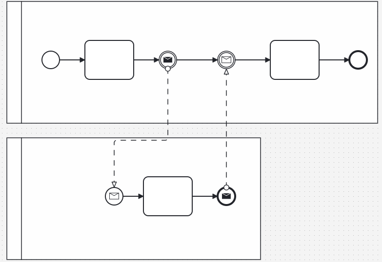

*Рисунок 7.24 – Міжпроцесна взаємодія через відправку повідомлень*

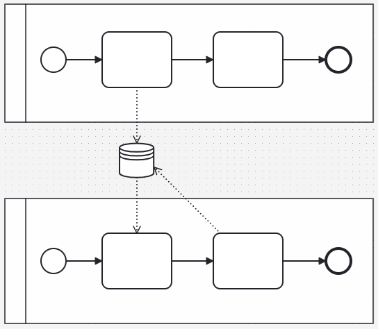

*Рисунок 7.25 – Міжпроцесна взаємодія через спільне сховище даних*

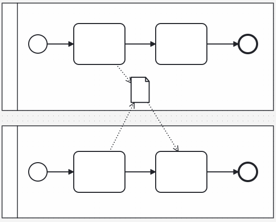

*Рисунок 7.26 – Міжпроцесна взаємодія через спільний об'єкт даних*

Міжпроцесна взаємодія з використанням повідомлень або сигналів передбачає наявність спеціалізованих задач або подій по відправці та отриманню контексту екземпляру процесу в інший процес. Даний варіант взаємодії передбачає синхронне виконання процесів.

Міжпроцесна взаємодія з використанням сховищ даних або об'єктів даних передбачає, що задачі різних процесів передають або отримують інформацію зі спільних сховищ даних або об'єктів даних. Даний варіант взаємодії підтримує асинхронне виконання процесів.

### Завдання на лабораторну роботу

1. Ознайомитись з основними елементами нотації BPMN.
2. Створити BPMN діаграму для наступного процесу:
   a) Процес починається з підготовки комерційної пропозиції.
   b) Комерційна пропозиція надсилається клієнту.
   c) Якщо клієнт повідомляє про прийняття пропозиції, її необхідно обробити.
   d) Якщо клієнт відхиляє пропозицію, її необхідно скасувати.
   e) Якщо відповідь не надходить протягом одного місяця, тоді потрібно надіслати нагадування.
   f) Якщо після трьох нагадувань відповідь не надходить, тоді пропозиція скасовується.
3. Створити BPMN діаграму для наступних процесів
   a) Менеджер створює замовлення.
   b) Менеджер надсилає замовлення підряднику і очікує доставку.
   c) Якщо замовлення не доставлено протягом зазначеного терміну, менеджер повинен зв'язатися з транспортною компанією.
   d) На основі відповіді від компанії менеджер приймає рішення: чекати доставки або припинити очікування.
   e) Якщо замовлення доставлено, то комірник повинен перевірити доставлені товари. Якщо надходження відповідає позиціям в замовленні, що було створено менеджером, комірник приймає доставку та повідомляє менеджера. В іншому випадку комірник не приймає доставку.

### Вимоги до звіту

Звіт повинен містити:

– титульний аркуш (додаток 1);
– назву та мету роботи;
– BPMN діаграма для першого та другого процесу;
– висновки.

### Контрольні питання

1. Для чого використовується нотація BPMN?
2. Які ключові елементи нотації BPMN?
3. В чому полягає відмінність між доріжкою та пулом?
4. На які два типи поділяються шлюзи в нотації BPMN?
5. На які підтипи поділяються події?

## ЛАБОРАТОРНА РОБОТА №8
### РОЗРОБКА ФУНКЦІОНАЛЬНИХ ВИМОГ В ФОРМАТІ ВАРІАНТІВ ВИКОРИСТАННЯ ТА ІСТОРІЙ КОРИСТУВАЧА

**Мета роботи** – отримати навички аналізу та документування функціональних вимог в форматі сценаріїв використання (Use Case) та історій користувача (User Story)

### Короткі теоретичні відомості

Варіант використання (Use case) – це формат опису спостережуваної взаємодії між актором (або акторами) та рішенням, яка відбувається, коли актор використовує систему для досягнення певної мети [10].

Сценарій – це один спосіб досягнення актором своєї мети. Варіант використання включає в себе всі можливі варіанти розвитку подій при досягненні цілей, що підтримуються рішенням.

Сценарії діляться на три групу:

– основний сценарій (потік подій) – найпростіший шлях досягнення мети;
– альтернативні сценарії (потоки подій) – більш складні шляхи досягнення мети;
– виключні сценарії – варіанти розвитку подій, коли користувач не досягає мети.

При оформленні вимог в форматі варіанту використання є допустим об'єднання альтернативних та виключних сценаріїв в рамках однієї секції.

Варіант використання може бути сформульований на рівні наскрізного бізнес-процесу (бізнес варіант використання) або на рівні одного або декількох кроків бізнес-процесу (системний варіант використання).

Для бізнес варіантів використання характерна наявність декількох учасників та виконання протягом відносно довгого часу. Приклади бізнес варіанту використання: оформлення права власності на квартиру, замовлення та доставка товару.

В системних варіантах використання зазвичай є лише один учасник, тривалість виконання коротка. Приклади системних варіантів використання: реєстрація заяви, формування виписки з реєстру.

В рамках IT-проєктів бізнес-аналітики частіше використовують системні варіанти використання як формат оформлення функціональних вимог для передачі команді розробки та тестування [13, 14].

Варіант використання містить наступні елементи:

– назва;
– ціль;
– актор;
– передумови;
– активатор або тригер;
– основний потік подій;
– альтернативні потоки подій;
– виключні потоки подій;
– результат;
– додаткові вимоги.

Назва варіанту використання має бути унікальною в рамках проєкту. Назва часто включає дієслово (описує дії актора) та іменник (над чим виконується дія або мета дії). Приклади назв: «Реєстрація користувача», «Формування та друк звіту».

Ціль це короткий опис того, що користувач хоче досягти за допомогою варіанта використання.

Актор це людина або інша система, які взаємодіють із розроблюваною системою в рамках варіанта використання. Актор повинен мати унікальне ім'я (це може бути назва посади або ролі, і ніколи не є ім'ям конкретної людини). Приклади акторів: неавторизований користувач, адміністратор системи.

Передумови це умови, які мають бути дійсними на початку виконання варіанта використання. Приклади передумов: користувач авторизований у системі; товар повинен існувати в каталозі; статус заявки – «Непідтверджена».

Активатор або тригер це подія, що ініціює виконання сценарію. Найчастіше тригером є дія з боку основного актора. Тригером також може виступати спрацьовування за таймером або іншою зовнішньою відносно системи подією. Приклади тригерів: користувач ініціював створення заяви; настав час формування резервної копії згідно з розкладом.

Основний потік подій описується із наскрізною нумерацією кроків.

Приклад основного потоку подій:

1. Система пропонує користувачеві вказати «Атрибути реєстрації за номером телефону».
2. Користувач заповнює атрибути та ініціює надсилання даних.
3. Система підтверджує коректність даних.
4. Система створює обліковий запис користувача. Статус запису "Непідтверджена«
5. Система пропонує користувачеві отримати код.
6. Користувач підтверджує отримання коду SMS.
7. Система генерує код та відправляє його користувачеві на вказаний номер телефону у SMS повідомленні.

Альтернативні та виключні потоки подій прописуються із наскрізною нумерацією кроків в рамках потоку. Номер потоку подій формується за наступним правилом: [номер кроку з основного потоку подій, по якому можлива альтернатива][літера, що визначає порядковий номер сценарію для цього кроку]

Приклад виключного потоку подій для кроку 2:

  2а Користувач відмовляється від виконання операції.
     2а.1 Система завершує виконання операції.

Приклад альтернативного потоку подій для кроку 3:

  3а. Внесена інформація не відповідає вимогам "Атрибути реєстрації за номером телефону".
      3а.1. Система відображає повідомлення про помилку.
      3а.2. Робота поновлюється з кроку 1. Користувач може редагувати раніше внесені дані.

Результат це твердження, які є дійсними після завершення варіанту використання. Результати можуть фіксуватися для всіх сценаріїв. Окремо можуть бути зафіксовані результати для основного, альтернативних і виключних потоків подій. Приклади результату: створено заяву в стані «чернетка», сформовано витяг.

Наведемо приклади оформлення вимог до функції «Реєстрація за номером телефону» в форматі варіанту використання:

Приклад 1. Реєстрація за номером телефону

| Визначення | Операція призначена для самостійної реєстрації користувача в Системі за номером телефону |
|---|---|
| Користувач | Неавторизований користувач |
| Тригер | Користувач ініціював виконання операції |
| Основний сценарій | 1. Система пропонує користувачеві вказати «Атрибути реєстрації номер телефону».  2. Користувач заповнює атрибути та ініціює надсилання даних.  3. Система підтверджує коректність даних.  4. Система пропонує користувачеві отримати код.  5. Користувач ініціює отримання коду.  6. Система генерує код та відправляє його користувачеві на вказаний номер телефону у SMS повідомленні.  7. Користувач вводить код.  8. Система перевіряє коректність коду.  9. Система створює обліковий запис. Система відображає користувачеві повідомлення про успішну реєстрацію. |
| Альтернативні сценарії | 2а, 5а 7а Користувач відмовляється від виконання операції.  2а.1, 5а.1 7а.1 Система завершує виконання операції.  3а. Внесена інформація не відповідає вимогам "Атрибути реєстрації за номером телефону".  3а.1. Система відображає повідомлення про помилку.  3а.2. Робота поновлюється з кроку 1. Користувач може редагувати раніше внесені дані.  7б. Користувач ініціює повторне надсилання коду.  7б.1. Робота поновлюється з кроку 6.  8а. Введено неправильний код.  8а.1. Система відображає повідомлення про помилку.  8а.2. Система відображає форму внесення коду. Робота поновлюється з кроку 7. |
| Результат | Зареєстровано обліковий запис користувача. |

Приклад 2. Формування запиту на відновлення паролю

| Визначення | Операція призначена для надання неавторизованому користувачу можливості отримати доступ до операції відновлення паролю. |
|---|---|
| Рівень | Користувача. |
| Розширюється | |
| Користувач | Неавторизований користувач |
| Передумови | Користувач ініціював виконання операції реєстрації. |
| Перебіг подій | 1. Система пропонує користувачу вказати електронну адресу (відповідно до «А7.2. Атрибути облікового запису» та «А7.7. Захист від роботів»).  2. Користувач вносить необхідні атрибути та ініціює продовження виконання операції.  3. Система впевнюється в коректності внесеної інформації.  4. Система пропонує користувачу обрати варіант отримання доступу до сторінки відновлення паролю: надіслати посилання для зміни паролю на e-mail або надіслати код доступу SMS.  5. Користувач обирає варіант отримання посилання на e-mail.  6. Система виконує [UC X.X] Відправка на e-mail посилання на сторінку зміни паролю. |
| Альтернативний шлях | 2а. Користувач відмовляється від виконання операції:  2а.1.Система завершує виконання операції.  3а. Перевірку не пройдено:  3а.1. Введені символи захисту від автоматичної реєстрації не відповідають вказаним на малюнку.  3а.2 Обліковий запис з вказаним e-mail не зареєстрований.  3а.*_1. Система видає відповідне повідомлення.  3а.*_2. Користувач повинен відредагувати внесені дані або відмовитись від продовження операції.  3б. Користувач невірно ввів символи захисту більше ніж 5 разів.  3б.1 Система відображає відповідне повідомлення та переходить на стартову сторінку сайту.  4а. В обліковому записі користувача не визначено моб. телефон:  4а.1 Система пропонує користувачу надіслати посилання для зміни паролю на e-mail.  5а. Користувач відмовляється від виконання операції:  5а.1 Система завершує виконання операції.  5б. Користувач обирає варіант з надсилання коду доступу SMS:  5б.1 Система виконує [UC X.Y] Надання доступу для зміни паролю за кодом з SMS.  5б.2 Перебіг подій завершується. |
| Результат | Сформовано на запит на зміну паролю. |
| Додаткові вимоги | Повинно виконуватись:  UI7.1 Відображення повідомлення щодо невідповідності внесених даних вимогам до вхідної інформації  UI7.2 Формат відображення переліку помилок та попереджень |

**Історія користувача (user story)** – стислий опис функціональності чи характеристики, яка потрібна для надання цінності певній зацікавленій стороні.

Історія користувача, як правило, складається з 1-2 речень, що описують:

– хто є зацікавленою особою історії;
– які цілі вона намагається досягти;
– будь-яку додаткову інформацію, яка має значення для розуміння меж історії.

Історії користувача можуть використовуватися для:

– виявлення потреб зацікавлених сторін та визначення пріоритетів,
– оцінки та планування робіт по створенню рішення,
– створення приймальних тестів,
– вимірювання трудомісткості,
– додаткового аналізу.

Історія користувача містить наступні елементи:

– назва
– Тіло історії

  a) хто: кінцевий користувач або зацікавлена особа, яка отримує вигоду або користь від реалізації історії;
  b) що: високорівневий опис функціональності/якості, що включена в історію;
  c) для чого: бізнес-цінність для актора;

– критерії приймання;
– додаткова інформація: вимоги до даних, прототипи інтерфейсів, множини бізнес-правил тощо.

При написанні тіла історії особливу увагу потрібно приділити третій частині – цінності. Розуміння проблеми або потреби, на вирішення якої спрямована історія користувача, дозволяє команді розробки визначити найбільш ефективний підхід до створення рішення.

Приклади історій користувача:

– Як пасажир (<роль>), я хочу мати можливість купити квиток на поїзд через Інтернет (<те, що я роблю за допомогою системою>), щоб заощадити час і не відвідувати касу особисто (<бізнес-цінність, яку я отримую>).
– Як учасник тренінгу (<роль>), я хочу мати можливість залишити відгук про тренінг (<те, що я роблю за допомогою системою>), Щоб поділитися своїми враженнями з іншими (<бізнес-цінність, яку я отримую>).
– Як учасник тренінгу (<роль>), я хочу мати можливість залишити відгук про тренінг (<те, що я роблю з системою>), Щоб дати зворотний зв'язок організаторам (<бізнес-цінність, яку я отримую>).

Другий та третій приклад історій користувача відрізняються тільки третьою частиною, але вона суттєво впливає на характер рішення, що має бути створене. Якщо друга історія передбачає подальшу публікацію відгука на загальнодоступному ресурсі з можливостями перегляду та пошуку відгука іншими користувачами, то третя історія передбачає опрацювання відгука лише представниками компанії.

Для перевірки якості історій користувача використовується набір критеріїв якості, що мають назву INVEST (акронім по першим літерам критеріїв):

– незалежна (Independent): історія користувача має бути самодостатньою і не залежати від інших історій;
– підлягає обговоренню (Negotiable): історія користувача можуть бути змінені, доки вони не стали частиною ітерації;
– цінна (Valuable): історія користувача має приносити цінність для зацікавлених сторін;
– піддається оцінці (Estimable): повинна бути можливість оцінити трудомісткість розробки історії користувача;
– невелика (Small): історія користувача не повинні бути великими, оскільки це може завадити плануванню та пріоритезації;
– піддається тестуванню (Testable): історія користувача повинна містити інформацію, необхідну і достатню для розробки тестів.

Слід зазначити, що критерій «Цінна» та «Невелика» можуть суперечити один одному: зменшення обсягів історії зазвичай призводить до зменшення цінності і навпаки. Подібні приклади можна навести і для інших критеріїв якості. Тому перед бізнес-аналітиком стоїть задача одночасного застосування всіх критеріїв у сукупності.

Критерії приймання визначають межі історії користувача та дають розуміння, яка поведінка або атрибути якості має забезпечити рішення, щоб принести цінність зацікавленим особам.

Для написання критеріїв приймання може використовуватись наступні підходи:

– критерії приймання у вигляді правил;
– поведінкові критерії приймання або формат «Given-When-Then».

Приклад критерії приймання у вигляді правил:

– Система має надавати можливість публікувати відгук тільки тим користувачам, які купили послугу;
– Поле для коментаря повинно мати не більше 1000 символів;
– По одному товару/послузі користувач може лишите лише один коментар.

Поведінкові критерії приймання складаються з трьох блоків:

1. Передумова (Given): Певний стан системи.
2. Тригер (When): Дія з боку зовнішнього актора/подія.
3. Результат (Then): Стан системи за результатами виконання тригера.

Приклади поведінкового критерія приймання:

| Передумова (Given) | Тригер (When) | Результат (Then) |
|---|---|---|
| Користувач неавторизований в системі. | Користувач ініціює створення облікового запису. | Система відображає користувачу форму реєстрації. |

Блоки «Передумова» та «Результат» можуть містити декілька підпунктів, об'єднаних логічним «та»:

| Передумова (Given) | Тригер (When) | Результат (Then) |
|---|---|---|
| Користувач авторизований в системі ТА Користувач вказав номер заяви для пошуку. | Користувач ініціював пошук по номеру | Система виконає пошук. ТА Система відображає знайдену заяву в режимі перегляду. |
| Користувач додав щонайменше одну позицію в замовлення | Користувач ініціював оформлення замовлення | Система забронювала обрані товари ТА Система обрахувала загальну вартість замовлення ТА Система відобразила інформацію про склад замовлення та його вартість ТА Система запропонувала користувачу обрати метод оплати |

Поведінковий критерій приймання може не мати передумови, якщо вона не впливає на результат спрацьовування тригера:

| Передумова (Given) | Тригер (When) | Результат (Then) |
|---|---|---|
| - | Користувач ініціює завершення роботи | Система зберігає всі незавершені транзакції користувача. ТА Система завершує роботу |

Також можлива відсутність тригера, якщо критерій приймання описує поведінку системи, яку вона демонструє в певному стані:

| Передумова (Given) | Тригер (When) | Результат (Then) |
|---|---|---|
| Не всі обов'язкові атрибути заповнені | - | Система позначає кольором незаповнені обов'язкові атрибути. |

Кількість критеріїв приймання для однієї історії зазвичай варіюється в межах від 3 до 7. Менша кількість критеріїв приймання може свідчити про недостатньо велику цінність історії або неврахування неуспішних сценаріїв розвитку подій. Занадто велика кількість критеріїв приймання може свідчити або про невдало вибраний підхід до формулювання критеріїв, або про занадто великий обсяг історії користувача. Для зменшення кількості критеріїв приймання можна винести в окремий розділ перелік бізнес-правил та вимог до вхідної інформації й послатись на них у відповідних критеріях приймання.

До сильних сторін історій користувача можна віднести наступне:

– легко сприймаються зацікавленими сторонами;
– можуть бути розроблені при використанні різних технік виявлення вимог;
– фокусуються на цінності для зацікавлених сторін;
– розуміння предметної області посилюється завдяки спільній роботі над визначенням і написанням історій користувача;
– адаптовані під швидку розробку та отримання зворотного зв'язку від замовника.

До недоліків цієї техніки документування вимог можна віднести:

– не підходять для довгострокового зберігання та детального аналізу вимог;
– команда може втратити бачення повної картини, якщо історії користувача явно не зв'язані на бізнес-цілі високого рівня;
– може знадобитися розробка додаткових документів для закриття вимог контракту або законодавства.

### Завдання на лабораторну роботу

1. Ознайомитись з техніками документування вимог «Варіант використання» та «Історія користувача».
2. За узгодженням з викладачем обрати варіант завдання (таблиця 1) для виконання лабораторної роботи.
3. Обрати дві функції системи відповідно до обраного завдання, окрім функцій авторизації, реєстрації та зміни пароля користувача.
4. Написати вимоги до однієї з обраних функцій у вигляді варіанту використання. Опис має містити щонайменше один альтернативний і один виключний сценарій.
5. Написати вимоги до іншої обраної функції у вигляді історії користувача, що містить щонайменше три критерії приймання в форматі «Given-When-Then».

### Вимоги до звіту

Звіт повинен містити:

– титульний аркуш (додаток 1);
– назву та мету роботи;
– варіант завдання;
– вимоги до функції системи у вигляді варіанту використання;
– вимоги до функції системи у вигляді історії користувача;
– висновки.

### Контрольні питання

1. З яких елементів складається структура варіанту використання?
2. Чим відрізняються основний, альтернативний і виключний сценарій?
3. Які два підходи до написання критеріїв приймання використовуються найчастіше?
4. З яких трьох частин складається тіло історії користувача?
5. Які критерії якості використовуються для оцінки історій користувача?

## СПИСОК ЛІТЕРАТУРИ

1. Silver B. BPMN Method and Style, 2nd Edition, with BPMN Implementer's Guide: A Structured Approach for Business Process Modeling and Implementation Using BPMN 2.0. – Aptos, CA : Cody-Cassidy Press, 2011. – xii, 269 p. – ISBN 978-0982368114.
2. Fowler M. UML Distilled: A Brief Guide to the Standard Object Modeling Language (3rd Edition) (The Addison-Wesley Object Technology Series) / Martin Fowler. – 3rd ed. – [S. l.] : Addison-Wesley Professional, 2003. – 208 p.
3. International Institute of Business Analysis. A Guide to the Business Analysis Body of Knowledge (BABOK® Guide). Version 3.0. – Toronto : International Institute of Business Analysis, 2015. – 504 p. – ISBN 978-1-927584-03-3.
4. Project Management Institute. The PMI Guide to Business Analysis. 1st ed. – Newtown Square, PA : Project Management Institute, 2018. – 444 p. – ISBN 978-1628251982.
5. Pohl K. Requirements Engineering: Fundamentals, Principles, and Techniques: Second edition. – [S.l.] : Springer Publishing Company, 2025. – 907 p. – ISBN 978-3662692042.
6. Paul D., et al. Business Analysis. 3rd ed. – [S.l.] : BCS, The Chartered Institute for IT, 2014. – 308 p.
7. Paul D., et al. Business Analysis Techniques: 99 Essential Tools for Success. 2nd ed. – [S.l.] : BCS, The Chartered Institute for IT, 2014. – 344 p.
8. Wiegers K., Beatty J. Software Requirements. 3rd ed. – [S.l.] : Pearson Education, 2013.
9. Gobov D., Yanchuk V. Network Analysis Application to Analyze the Activities and Artifacts in the Core Business Analysis Cycle // *2021 2nd International Informatics and Software Engineering Conference (IISEC).* – IEEE, 2021. – P. 1–6. – DOI: 10.1109/iisec54230.2021.9672373.
10. Cockburn A. Writing Effective Use Cases. – Boston : Addison-Wesley, 2000. – 304 p. – ISBN 0-201-70225-8.
11. Wiegers K., Hokanson C. Software Requirements Essentials: Core Practices for Successful Business Analysis. – Boston : Addison-Wesley Professional, 2023. – 208 p. – ISBN 978-0-13-819028-6.
12. Gobov D., Zuieva O. Software Quality Attributes in Requirements Engineering // *International Journal of Information Technology and Computer Science.* – 2025. – Vol. 17, no. 4. – P. 38–48. – DOI: 10.5815/ijitcs.2025.04.04.
13. Gobov D. Practical Study on Software Requirements Specification and Modelling Techniques // *International Journal of Computing.* – 2023. – Vol. 22, no. 1. – P. 78–86. – DOI: 10.47839/ijc.22.1.2882.
14. Гобов Д., Зуєва О. Identifying the dependencies between IT project context and business analysis document content // *Сучасний стан наукових досліджень та технологій в промисловості.* – 2023. – № 2 (24). – С. 39–53. – DOI: 10.30837/itssi.2023.24.039.
15. Miller R. E. The Quest for Software Requirements: Probing Questions to Bring Nonfunctional Requirements Into Focus; Proven Techniques to Get the Right Stakeholder Involvement. – Oconomowoc, WI : MavenMark Books, 2009. – 327 p. – ISBN 978-1-59598-067-0.
16. Gobov D., Sokolovskiy N. An Association Rule Mining for Selection Requirement Elicitation and Analysis Techniques in IT Projects // In: Jarzębowicz A., Luković I., Przybyłek A., Staroń M., Ahmad M. O., Ochodek M. (eds.) *Software, System, and Service Engineering.* Lecture Notes in Business Information Processing, vol. 499. – Cham : Springer, 2024. – DOI: 10.1007/978-3-031-51075-5_4.
17. International Institute of Business Analysis. *BABOK® Guide Glossary: Ukrainian Translation* [Електронний ресурс]. – Режим доступу: https://www.iiba.org/globalassets/standards-and-resources/glossary/files/babok-v3-glossary-ukrainian.pdf (дата звернення: 01.08.2025).
18. International Institute of Business Analysis. The Business Analysis Standard. Version 1.0. – Ontario, Canada: International Institute of Business Analysis, 2025. – 54 p. – ISBN 978-1927584378.
19. Гобов Д.А. *Аналіз зовнішніх та внутрішніх факторів або як правильно проводити SWOT аналіз* [Електронний ресурс]. – Режим доступу: https://www.artofba.com/uk/post/swot-analysis-and-strategy-generation (дата звернення: 01.08.2025).
20. Гобов Д. А. *Типові помилки у BPMN-діаграмах. Частина 1* [Електронний ресурс]. – Режим доступу: https://www.artofba.com/uk/post/common_mistakes_bpmn_diagrams_part1 (дата звернення: 01.08.2025).
21. Гобов Д. А. *Дорожня карта бізнес-аналізу. Частина 1* [Електронний ресурс]. – Режим доступу: https://www.artofba.com/uk/post/business-analysis-roadmap-1 (дата звернення: 01.08.2025).

## ДОДАТОК 1
### ТИТУЛЬНИЙ АРКУШ ЗВІТУ

Міністерство освіти і науки України
Національний технічний університет України «Київський політехнічний інститут імені Ігоря Сікорського»
Факультет інформатики та обчислювальної техніки

Кафедра інформатики та програмної інженерії

# Звіт

з лабораторної роботи №1 з дисципліни «Бізнес-аналіз в IT»
«Аналіз зацікавлених осіб: матриця зацікавлених осіб»
Варіант___

Виконав студент _______________________
*(шифр, прізвище, ім'я, по батькові)*

Перевірив викладач _______________________
*(прізвище, ім'я, по батькові)*

Київ 202_ рік
