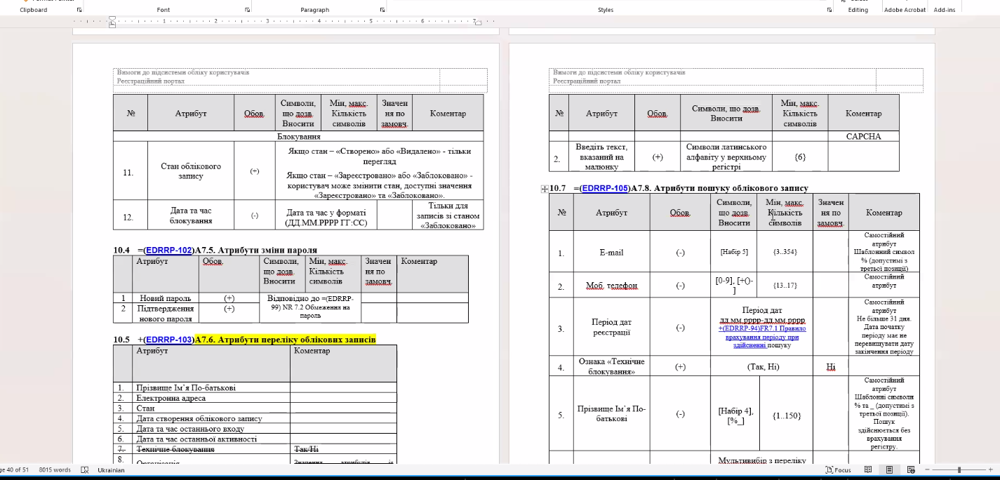
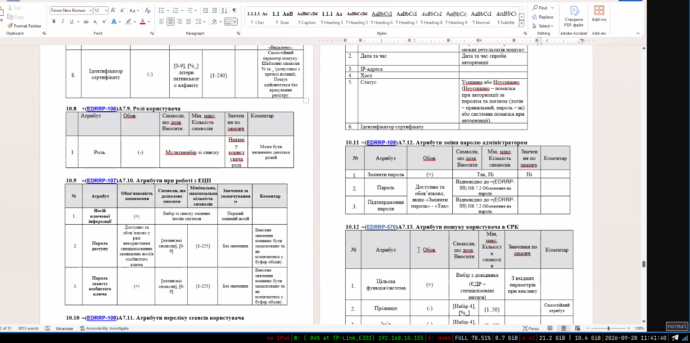
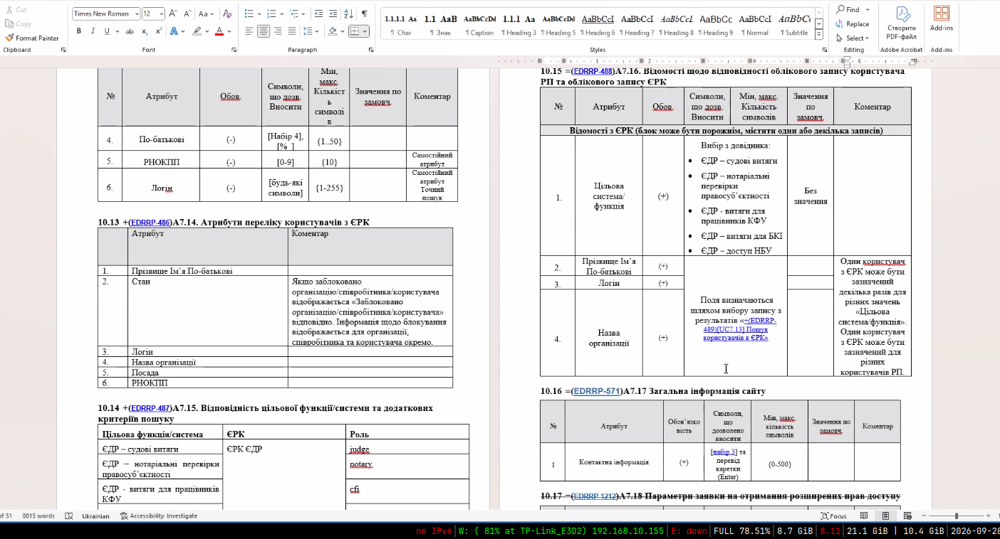
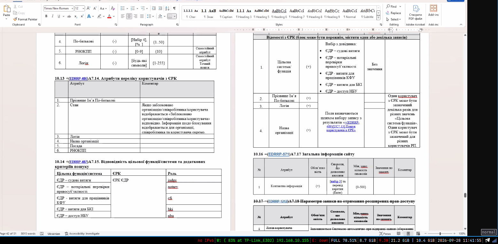
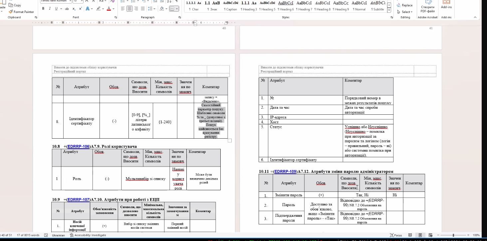

крок 3 система пропонує формат отримання, щось тут не погоджується з 3а, 

можливо ще має бути окрема табличка з вимогами до даних, можливо вона є в методичці

коротше тут альтернативи, кроки не стикуютьсяч як на мене 

ми маємо надати інформацію, які атрибути має заповнити, які опціональні, і на рівні цього словника даних, то наприклад якщо це електронна книжка, то адреса лоставки не потрібна 

і це краще писати не у виклдяі кроків, а в уигляді вимог до даних

і ще актівіті діграма не відповідає юзкейс, її треба переробити, можливо, щоб було зручніше переробити.

тобто виглядає дивним, що пішов розсинхрон юз кейс та актівіті. 

